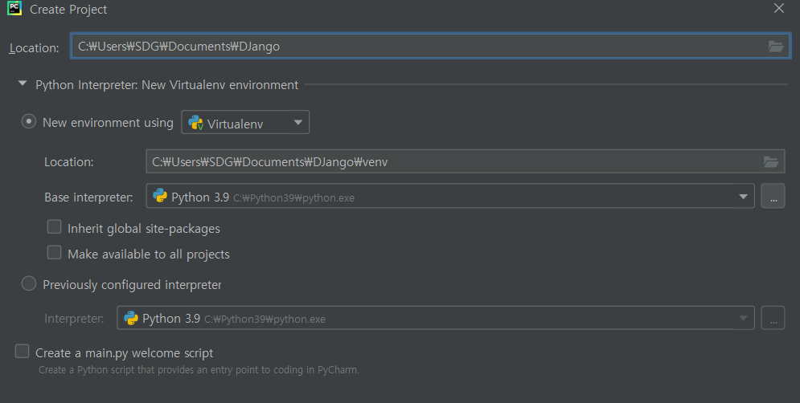
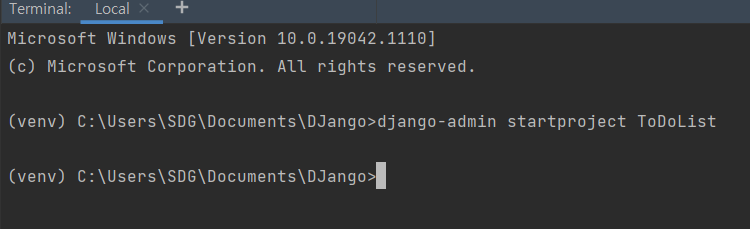
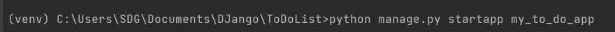
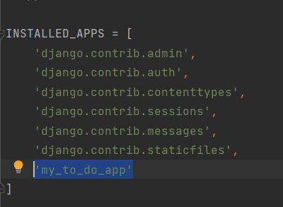
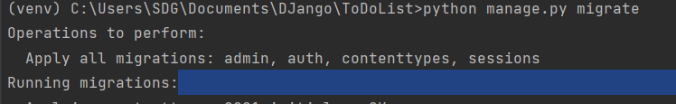
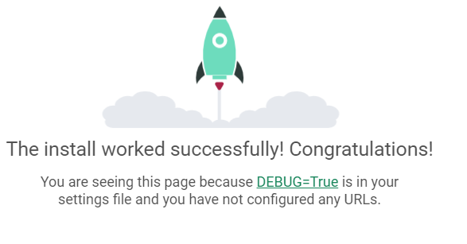

# Django 


## 1. 프로젝트 생성

1) 파이참 File -> new Project 




2. 터미널에 장고 인스톨  및 장고 프로젝트 시작

   - pip install django
   - django-admin startproject ToDoList

   


3. django app 시작(필요한 만큼 생성)

   - ToDoList 디렉터리 에서 python manage.py startapp my_to_do_app

     


4. ToDoList/settings.py 파일 열고 INSTALLED_APPS ='my_to_do_app' 에 앱 이름 등록

   ​	


5. Django migrate 진행
   : 데이터베이스에 테이블, 필드 등의 변경이 발생했을 때 지정된 데이터베이스에 적용하는 과정을 의미

   - python manage.py migrate

     


6. 서버 구동 코드

   - python manage.py runserver

   - http://127.0.0.1:8000/

     


7.  ToDoList/urls.py 수정

   ```python
   from django.contrib import admin
   from django.urls import path, include
   
   urlpatterns = [
       path('', include('my_to_do_app.urls')), # my_to_do_app.urls.py 파일을 생성해야함
       # http://127.0.0.1:8000 으로 시작하는 모든 요청은 my_to_do_app.urls 로 전달
       path('admin/', admin.site.urls), # 장고가 제공하는 관리자 사이트의 URL 완성이므로 필요하면 사용 하면 됨
       # http://127.0.0.1/admin/ : 현재 파일에서 매칭		
   ]
   
   ```

   

8. my_to_do_app폴더 밑에 urls.py 생성

   ```python
   # my_to_do_app > urls.py
   from django.urls import path
   from . import views
   urlpatterns = [
       path('', views.index, name = 'index')
   ]
   ```


9. my_to_do_app/views.py 수정후 run server로 확인

   ```python
   from django.shortcuts import render
   from django.http import HttpResponse
   
   # Create your views here.
   def index(request) :
       return HttpResponse("my_to_do_app first page")
   ```


10.  my_to_do_app/Templates/my_to_do_app/index.html 생성


11. my_to_do_app/views.py 수정

    ```python
    from django.shortcuts import render
    from django.http import HttpResponse
    
    # Create your views here.
    def index(request) :
        return render(request,'my_to_do_app/index.html')
        # 요청에 대한 응답객체를 생성해서 바로 클라이언트로 반환
    
    ```


12. ToDoList/my_to_do_app/models.py 수정

    - models.py를 수정했으면 python manage.py makemigrations 로 서버 반영해야한다

    ```python
    from django.db import models
    
    # Create your models here.
    class Todo(models.Model) : # modles.Model 을 상속받아 Django 모델 class 생성
        # 컬럼 지정 - 기본키 생성안하면 자동 생성
        content = models.CharField(max_length=255)
    ```

python manage.py migrate


13. run server 해서 메모하기 버튼 클릭시 404 error 확인


14. ToDoList/ToDoList/urls.py 수정

    ```python
    from django.contrib import admin
    from django.urls import path, include
    
    urlpatterns = [
        path('', include('my_to_do_app.urls')), # my_to_do_app.urls.py 파일을 생성해야함
        # http://127.0.0.1:8000 으로 시작하는 모든 요청은 my_to_do_app.urls 로 전달
        path('admin/', admin.site.urls), # 장고가 제공하는 관리자 사이트의 URL 완성이므로 필요하면 사용 하면 됨
        # http://127.0.0.1/admin/ : 현재 파일에서 매칭
    ]
    ```

    

15. ToDoList/my_to_do_app/urls.py 수정

    ```python
    # my_to_do_app > urls.py
    from django.urls import path
    from . import views
    urlpatterns = [
        path('', views.index, name = 'index'),
        # root url conf에 의해서 http://127.0.0.1:8000의 요청이 전달되면
        # views.py 파일의 index 함수 코드를 실행
        # http://127.0.0.1:8000 url 별명은 'index'
    
        # http://127.0.0.1:8000/createTodo/ 요청에 대한 설정
        path('createTodo/', views.createTodo, name='createTodo')
    ]
    ```


16. ToDoList/my_to_do_app/views.py 수정

    ```python
    from django.shortcuts import render
    from django.http import HttpResponse, HttpResponseRedirect
    from .models import *
    
    # Create your views here.
    def index(request) :
        todos = Todo.objects.all() # select * from my_to_do_app_todo;
        # template으로 전달할 dict 구성
        content = {'todos':todos} # index.html에서 동적으로 코드를 생성할 때 dict를 사용
        return render(request,'my_to_do_app/index.html', content) 
    
    def createTodo(request) :
        # 사용자가 메모에 입력해서 넘긴 값을 반환하는 코드
        user_input_str = request.POST['todoContent']
        new_todo = Todo(content=user_input_str) # insert into todo(content) values (input_str)
        new_todo.save() # db에 반영
    
        return HttpResponseRedirect(reverse('index'))
        
    ```

    

17. index.html 수정

    ```html
    <div class="toDoDiv">
                    <ul class="list-group"> /* content = {'todos':todos} */
                        
                        <form action="" method="GET">
                            <div class="input-group" name='todo1'>
                                <li class="list-group-item">{{ todo.content }}</li>
                                <input type="hidden" id="todoNum" name="todoNum" value="1"></input>
                                <span class="input-group-addon">
                                    <button type="submit" class="custom-btn btn btn-danger">완료</button>
                                </span>
                            </div>
                        </form>
                        
                    </ul>
    ```

runserver 해서 메모버튼 클릭시 추가되는지 확인


18.  메모 삭제버튼 index.html 수정

    ```html
    <form action="./doneTodo/" method="GET">
                            <div class="input-group" name='todo1'>
                                <li class="list-group-item">{{ todo.content }}</li>
                                <input type="hidden" id="todoNum" name="todoNum" value="{{todo.id}}"></input>
    ```


19. my_to_do_app/urls.py 에 path 추가

    ```python
    path('doneTodo/', views.doneTodo, name='doneTodo') # 추가
    ```


20. views.py에 함수 추가

    ```python
    def doneTodo(request) :
        # 삭제할 메모의 id 저장
        done_todo_id = request.GET['todoNum']
        print("완료한 메모의 id ", done_todo_id)
        todo = Todo.objects.get(id=done_todo_id) # 넘어온 done_todo_id와 동일한 기본키를 찾아서 해당 레코드를 반환
        todo.delete() # 반환된 객체에 대해 delete 진행
        return HttpResponseRedirect(reverse('index'))
    ```

    

