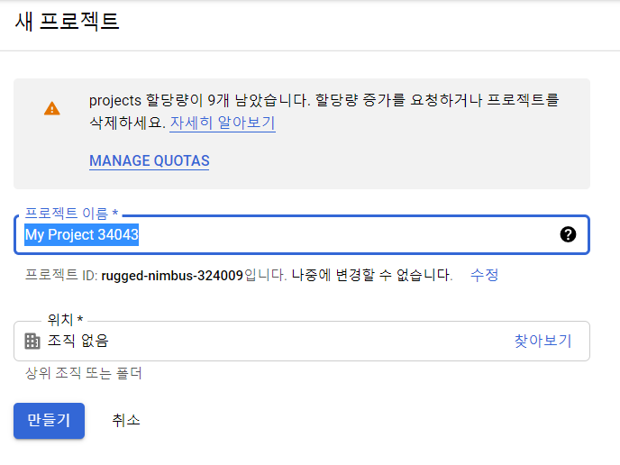
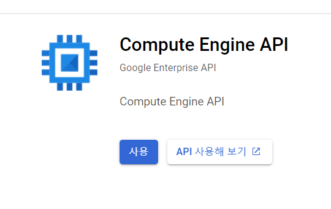
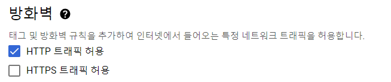
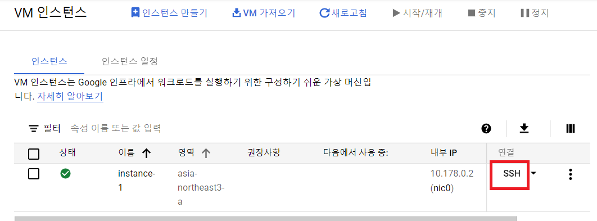

# GCP

[GCP 시작하기](https://cloud.google.com/gcp/getting-started?authuser=2)

## 1. Linux VM 만들기

```
VM 인스턴스를 만들고, 연결하고, 삭제합니다.
제품: Google Compute Engine
```


### 1. **시작 하기 전에**

1) [프로젝트 생성](https://console.cloud.google.com/projectselector2/home/dashboard?authuser=2&_ga=2.24592441.2064428097.1630058388-307852693.1629880764&_gac=1.150603204.1629884416.CjwKCAjw1JeJBhB9EiwAV612y31Ubb2W14YX8c9eQNH80kOlKwjhPBNI_QtVpBe3jRqqxYuNBCSoERoCEy0QAvD_BwE)에서 새 프로젝트 만들기



2. [Compute Engine API](https://console.cloud.google.com/apis/api/compute.googleapis.com/overview?authuser=2&_ga=2.201845778.2064428097.1630058388-307852693.1629880764&_gac=1.86566250.1629884416.CjwKCAjw1JeJBhB9EiwAV612y31Ubb2W14YX8c9eQNH80kOlKwjhPBNI_QtVpBe3jRqqxYuNBCSoERoCEy0QAvD_BwE) 사용 설정




### 2. **Linux VM 인스턴스 만들기 **

1. Cloud Console에서 [VM 인스턴스](https://console.cloud.google.com/compute/instances?authuser=2&_ga=2.128976655.2064428097.1630058388-307852693.1629880764&_gac=1.57426520.1629884416.CjwKCAjw1JeJBhB9EiwAV612y31Ubb2W14YX8c9eQNH80kOlKwjhPBNI_QtVpBe3jRqqxYuNBCSoERoCEy0QAvD_BwE&project=my-first-vm-324009&folder=&organizationId=) 페이지로 이동

2. **인스턴스 만들기** 클릭

3. **부딩 디스크** 섹션에서 **변경**을 클릭하여 부팅 디스크 구성을 시작

4. **Public images**탭에서 **Ubuntu 20.04 LTS** 선택

   

5. **선택** 클릭

6. **방화벽** 섹션에서 **HTTP 트래픽 허용** 선택

   

7. **만들기** 클릭하여 인스턴스 만들기


### 3. VM 인스턴스에 연결


1. Cloud Console에서 **[VM 인스턴스](https://console.cloud.google.com/compute/instances?authuser=2&_ga=2.256190216.2064428097.1630058388-307852693.1629880764&_gac=1.57732824.1629884416.CjwKCAjw1JeJBhB9EiwAV612y31Ubb2W14YX8c9eQNH80kOlKwjhPBNI_QtVpBe3jRqqxYuNBCSoERoCEy0QAvD_BwE&project=my-first-vm-324009&folder=&organizationId=)** 페이지로 이동

2. 가상 머신 인스턴스 목록에서연결할 인스턴스 행의 **SSH**를 클릭

   


---

## 2. 파일 저장 및 공유

```
버킷을 생성하고, 파일을 업로드 및 공유하고, 폴더로 정리합니다.
제품: Google Cloud Storage
```


### 1. 버킷 만들기

- 버킷은 Cloud Storage에서 데이터를 보관하는 기본 컨테이너

1. Google Cloud Console에서 Cloud Storage **[브라우저](https://console.cloud.google.com/storage/browser?authuser=2&_ga=2.28648255.2064428097.1630058388-307852693.1629880764&_gac=1.151078603.1629884416.CjwKCAjw1JeJBhB9EiwAV612y31Ubb2W14YX8c9eQNH80kOlKwjhPBNI_QtVpBe3jRqqxYuNBCSoERoCEy0QAvD_BwE)** 페이지로 이동

2. **버킷 생성**을 클릭하여 다음과 같이 버킷 생성 

   - 버킷의 고유한 **이름** 입력
   - 위치유형 **Multi-Region**, 위치 **Asia**

   - 기본 스토리지 클래스 **Standard** 
   - 객체 제어 엑세스 방식 : **균일한 엑세스 제어**


### 2. 버킷에 객체 업로드

1.  Cloud Storage **[브라우저](https://console.cloud.google.com/storage/browser?authuser=2&_ga=2.28648255.2064428097.1630058388-307852693.1629880764&_gac=1.151078603.1629884416.CjwKCAjw1JeJBhB9EiwAV612y31Ubb2W14YX8c9eQNH80kOlKwjhPBNI_QtVpBe3jRqqxYuNBCSoERoCEy0QAvD_BwE)** 페이지에서 앞서 만든 버킷의 이름 클릭
2. **객체** 탭에서 **파일 업로드** 클릭
3. 파일 업로드


### 3. 객체 다운로드

1. 버킷에서 객체를 클릭하고 **다운로드** 클릭


### 4. 객체 공유

- 버킷에 대한 공개 액세스를 허용하고 이미지에 대해 **공개적으로 액세스 가능한 URL**을 만들기

1. 파일 목록 위에 있는 **권한** 탭을 클릭
2. 뷰가 **구성원**으로 설정되어 있는지 확인. **추가**를 클릭하면 구성원 추가 창이 나타난다.
3. **새 구성원** 상자에 ``allUsers``를 입력
4. **역할 선택** 드롭다운에서 **Cloud Storage > 저장소 객체 뷰어**를 선택

5. **저장** 클릭
6. **이 리소스를 공개로 설정하시겠습니까?** 창에서 **공개 액세스 허용**을 클릭


### 5. 버킷에서 공개 액세스 삭제 및 공개 공유 중지

1. 객체 목록 위에 있는 **권한** 탭을 클릭
2. **구성원** 열에서 **allUsers**가 나열된 항목을 찾고, 해당 항목의 체크박스를 선택
3. **삭제**를 클릭
4. **allUsers 삭제** 창에서 **확인**을 클릭
5. **객체** 탭에서 이지미에 더 이상 **URL 복사** 버튼이 없다는 것을 확인


---

## 3. Docker 컨테이너 이미지 배포

```
Cloud Shell을 사용하여 gcloud를 구성하고 컨테이너 이미지를 실행합니다.

제품: Kubernetes Engine, Cloud SDK
```


### 1. 시작하기 전에

- [Artifact Registry and Google Kubernetes Engine API](https://console.cloud.google.com/flows/enableapi?apiid=artifactregistry.googleapis.com%2Ccontainer.googleapis.com&authuser=2&_ga=2.223405465.384558117.1630223278-307852693.1629880764&_gac=1.86565482.1629884416.CjwKCAjw1JeJBhB9EiwAV612y31Ubb2W14YX8c9eQNH80kOlKwjhPBNI_QtVpBe3jRqqxYuNBCSoERoCEy0QAvD_BwE) 사용 설정
- 다음에 필요한 [사용 가능한 할당량](https://console.cloud.google.com/iam-admin/quotas?authuser=2&_ga=2.222347673.384558117.1630223278-307852693.1629880764&_gac=1.117189364.1629884416.CjwKCAjw1JeJBhB9EiwAV612y31Ubb2W14YX8c9eQNH80kOlKwjhPBNI_QtVpBe3jRqqxYuNBCSoERoCEy0QAvD_BwE&project=my-first-vm-324009&folder=&organizationId=)이 있는지 확인
  - 클러스터의 리전의 Compute Engine CPU 1개
  - 사용 중인 IP 주소 1개


### 2. Cloud Shell 실행

1. [Google Cloud Console](https://console.cloud.google.com/home/dashboard?project=my-first-vm-324009&authuser=2&_ga=2.116140164.384558117.1630223278-307852693.1629880764&_gac=1.147989189.1629884416.CjwKCAjw1JeJBhB9EiwAV612y31Ubb2W14YX8c9eQNH80kOlKwjhPBNI_QtVpBe3jRqqxYuNBCSoERoCEy0QAvD_BwE)로 이동
2. Console의 오른쪽 상단에서 **Cloud Shell 활성화** 버튼 클릭  
3. Console 하단의 프레임에서 Clud Shell 세션이 열림. 이 셸을 사용하여 ``gcloud`` 및 ``kubect1`` 명령어를 실행


### 3. gcloud 도구의 기본 설정 구성

- ``gcloud`` 도구를 사용하여 기본 **프로젝트, 컴퓨팅 영역, 컴퓨팅 리전**의 세가지 기본 설정을 구성

- 프로젝트에는 고유 식별자인 프로젝트 ID가 있다. 프로젝트를 처음 만들 때는 자동 생성되는 프로젝트 ID를 사용하거나 사용자 고유의 ID를 만들 수 있다.

- **컴퓨팅 영역**은 클러스터와 리소스가 존재하는 리전의 위치. 예를 들어 ``us-west1-a``는 ``us-west`` 리전의 영역. **컴퓨팅 리전**은 클러스터와 리소스가 존재하는 리전(예를 들어 ``us-west``)이다.

- ``gcloud``를 사용하려면 작업할 프로젝트와 위치를 지정해야 하므로 이러한 기본 설정을 구성하면 ``gcloud`` 명령어를 더욱 쉽게 실행할 수 있습니다. ``--project``, ``--zone``, ``--region``, ``--cluster``와 같은 플래그를 ``gcloud`` 명령어에 사용하여 이러한 설정을 지정하거나 기본 설정을 재정의할 수 있다.

- 기본 프로젝트, 영역, 리전을 구성한 후 GKE 리소스를 만들면 프로젝트, 영역, 리전에 리소스가 자동으로 생성된다.

  1. 기본 프로젝트를 설정

     ```shell
     gcloud config set project PROJECT_ID
     ```

     - 여기서 PROJECT_ID는 [Console](https://console.cloud.google.com/home/dashboard?project=my-first-vm-324009&authuser=2&_ga=2.182134053.384558117.1630223278-307852693.1629880764&_gac=1.216205796.1629884416.CjwKCAjw1JeJBhB9EiwAV612y31Ubb2W14YX8c9eQNH80kOlKwjhPBNI_QtVpBe3jRqqxYuNBCSoERoCEy0QAvD_BwE)에서 프로젝트 정보 칸에서 찾을 수 있다.

     

  2.  기본 영역 설정

     ```sh
     gcloud config set compute/zone COMPUTE_ZONE
     gcloud config set compute/zone asia-northeast3-a # 서울
     ```

     - 여기서 COMPUTE_ZONE을 컴퓨팅 영역으로 바꿔준다.(예를 들어 ``us-west1-a``).

     - 사용 가능한 리전 목록 보기

       ```
       gcloud compute regions list
       ```

       

  3.  기본 리전 설정

     ```sh
     gcloud config set compute/region COMPUTE_REGION
     gcloud config set compute/region asia-northeast3 # 서울
     ```

     - 여기서 COMPUTE_REGION을 컴퓨팅 리전으로 바꿔준다. (예를 들어 ``us-west1``).


## 4. GKE 클러스터 만들기

- 클러스터는 클러스터 제어 영역 머신 한 개 이상과 노드라는 작업자 머신 여러 개로 구성
- 노드는 클러스터를 구성하기 위해 필요한 Kubernetes 프로세스를 실행하는 Compute Engine 가상 머신(VM) 인스턴스
- 클러스터에 애플리케이션을 배포하고 애플리케이션은 노드에서 실행된다.
- GKE(Google Kubernetes Engine)에서 클러스터를 만들려면 작업 모드로 표준 또는 Autopilot을 선택 해야 한다.
- 표준 모드를 사용하는 경우 클러스터는 영역 클러스터
- Autopilot 모드를 사용하는 경우 클러스터는 리전 클러스터


1. ``hello-cluster``라는 **단일 노드 표준 클러스터** 생성하기

   ```sh
   gcloud container clusters create hello-cluster --num-nodes=1
   ```

   클러스터 생성이 완료되는 데 몇 분이 걸릴 수 있습니다.

2. 클러스터의 사용자 인증 정보 얻기

   - 클러스터를 만든 후 클러스터와 상호작용하려면 사용자 인증 정보를 가져와야 합니다.

   ```sh
   gcloud container clusters get-credentials hello-cluster
   ```

   이 명령어는 생성한 클러스터를 사용하도록 ``kubect1``을 구성합니다.


## 5. 클러스터에 애플리케이션 배포

- 클러스터가 생성되었으므로 이제 컨테너식 애플리케이션을 배포할 수 있습니다.


#### 1. 배포 만들기

- 클러스터에 ``hello-app``을 실행하려면 다음 명령어를 실행하여 애플리케이션을 배포 해야 한다.

  ```sh
  kubectl create deployment hello-server \
      --image=us-docker.pkg.dev/google-samples/containers/gke/hello-app:1.0
  ```

  - 이 Kubernetes 명령어 ``kubectl create deployment``는 ``hello-server``라는 배포를 만듭니다. 배포의 Pod는 ``hello-app`` 컨테이너 이미지를 실행 한다.
  - ``--image``는 배포할 컨테이너 이미지를 지정한다. 이 경우 명령어는 예시 이미지를 Artifact Registry 저장소인 ``asia-docker.pkg.dev/google-samples/containers/gke/hello-app``에서 가져 온다.
  - ``:1.0``은 가져올 특정 이미지 버전을 나타낸다. 버전을 지정하지 않으면 기본 태그가 ``lastest``인 이미지가 사용 된다.


#### 2. 배포 노출

- 애플리케이션을 배포한 후에는 사용자가 액세스 할 수 있도록 이를 인터넷에 노출해야 한다.

- 애플리케이션을 외부 트래픽에 노출하는 Kubernetes 리소스인 서비스를 만들어 애플리케이션을 노출할 수 있다.

- 애플리케이션을 노출하려면 ``kubectl expose`` 명령어를 실행

  ```shell
  kubectl expose deployment hello-server --type LoadBalancer --port 80 --target-port 8080
  ```

  - ``--type LoadBalancer`` 플래그를 전달하면 컨테이너의 Comute Engine 부하 분산기가 생성된다.
  - ``--port`` 플래그는 인터넷에 공개 포트 80을 초기화하고
  - ``--target-port`` 플래그는 트래픽을 애플리케이션의 포트 8080으로 라우팅


#### 3. 애플리케이션 검사 및 보기

1. ``kubectl get pods``를 사용하여 실행 중인 Pod를 검사

   ```shell
   kubectl get pods
   ```

   클러스터에서 하나의 ``hello-server`` pod가 실행 중임을 볼 수 있다.

2. ``kubectl get service``를 사용하여 ``hello-server`` 서비스를 검사

   ```shell
   
   ```

   이 명령어의 출력에서 ``EXTERNAL-IP`` 열에 있는 서비스의 외부 IP 주소를 복사한다.

3. 외부 IP주소와 노출된 포트를 사용하여 웹 브라우저에서 애플리케이션을 확인

   ```http
   http://EXTERNAL_IP:PORT
   ```

   GKE에 컨테이너식 웹 애플리케이션을 배포했습니다.


#### 4. 삭제

1. ``kubectl delete``를 실행하여 애플리케이션의 서비스를 삭제한다.

   ```shell
   kubectl delete service hello-server
   ```

   이 명령어는 배포를 노출할 때 만든 Compute Engine 부하 분산기를 삭제합니다.

2. ``gcloud container clusters delete``를 실행하여 클러스터를 삭제

   ```shell
   gcloud container clusters delete hello-cluster
   ```

   