# 머신 러닝

## 머신러닝이란?

- 머신러닝은 기계를 가르친다는 뜻인데, 기게를 어떻게 가르칠 것인가에 따라 두 가지로 나눠서 생각 할 수있다.
  - **Supervised Learning (지도 학습)**
  - **UnSupervised Learning (비지도 학습)**


### 1. Supervised Learning (지도 학습)

- 지도 학습은 데이터에 레이블(정답)이 미리 정해져 있을 때 가능하다.
- 그래서 프로그램에 입력값을 주면 출력값을 기계가 예측해주는 거다.
- 지도 학습은 또 다시 **Regression(회귀)**와 **Classification(분류)**로 세분화 할 수있다.
- **Regression(회귀)** : 연속된 값, 수치, 즉 '얼마나'를 예측
- **Classification(분류)** : 연속적이지 않은 값, 다시 말해 '무엇'을 예측


### 2. Unsupervised Learning (비지도 학습)

- 비지도 학습은 레이블(정답)이 정해져 있지 않은 데이터를 기반으로 데이터의 고유한 구조나 패턴을 익히는 것.
  - **Clustering(군집화) ** : 데이터에서 패턴과 구조를 찾아 그룹을 지어줌

-  분류는 정답을 맞히는 거고 클러스터링은 비슷한 것들끼리 묶어주는 거다. 전혀 다른 거다.


---

## 머신러닝에서 학습세트, 평가세트를 나누는 이유와 방법

- 우리는 머신러닝을 통해서 예측이나 분류를 할 수있다. 그런데 이 예측이나 분류가 얼마나 정확한지 자문하는 것이 중요하다.
- 지도학습(Supervised learning)에서는 다행히도 이미 레이블링 된(정답이 있는) 데이터가 있기 때문에 그걸 활용해서 알고리즘의 정확도를 테스트 할 수 있다.
- 머신러닝 모델의 효과성을 검증하기 위해 데이터를 나눌 때 보통 아래와 같이 세 개의 개념을 이해하면 된다.
  - **Training Set (학습 세트)**
  - **Validation Set (검증 세트)**
  - **Test Set(평가 세트)**
- 이 중 검증 세트와 평가 세트는 사실 유사한 개념이다.


### 학습 세트(Training Set)와 검증 세트(Validation Set)

- **학습 세트(Training Set)**는 말그대로 **알고리즘이 학습할 데이터**다.
- 이 학습 데이터 세트를 사용하여 모델을 학습시키고 나면 이후에는 **검증 세트(Validation Set)를 통해 모델의 예측/분류 정확도를 계산**할 수 있다.
- 사실 모든 검증 세트에 대한 **실제 레이블, 즉 정답을 알고 있지만 그렇지 않은 척** 하는 셈이다.
- 그래서 새로운 데이터인 것처럼 분류/예측 모델에 입력해준다.
- 실제로 학습 시킬 때 이 데이터들을 배제했기 때문에 가능하다.
- 예측/분류된 값을 받아서 실제로 갖고 있던 답과 비교하기만 하면 결국 **정확도(Accuracy)**를 알 수 있는 거다.

- 물론 여기서 말하는 **정확도(Accuracy)**가 만능의 지표는 아니다.
- 머신러닝 알고리즘의 효과를 판단할 때 오히려 **정밀도(precision)**과 **재현율(recall)**, 그리고 정확률과 정밀도의 조화평균인 **F1 점수**를 확인하는 등의 방법도 있다.


### 어떻게 데이터 세트를 나눌 것인가 

- 학습세트 vs 검증세트를 어떤 비율로 분할할지 판단하기가 쉽지 않다.
- 학습 세트가 너무 작으면 알고리즘이 효과적으로 학습하기에 충분치 않을 수 있다.
- 반면, 검증 데이터가 너무 작으면 이를 통해 계산한 정확도(Accuracy), 정밀도(precision), 재현율(recall), F1 점수가 서로 차이가 많이나서 신뢰하기 어려울 수 있다.
- 일반적으로 **전체 데이터 중 80%를 학습으로, 20%를 검증으로 사용하는 것이 좋다**고 한다.
- 


---

## 선형회귀 (Linear Regression)


### 1. 선형회귀란

머신 러닝의 가장 큰 목적은 실제 데이터를 바탕으로 모델을 생성해서 다른 입력 값을 넣었을 때 발생하는 결과 값을 예측하는데에 있다.


이때 우리가 찾아낼 수 있는 가장 직관적이고 간단한 모델인 **선(line)**이다. 그래서 데이터를 놓고 그걸 가장 잘 설명할 수있는 선을 찾는 분석 방법을 **선형 회귀(Linear Regression)** 분석이라 부른다.


예를 들어 키와 몸무게를 데이터를 다음과 같이 점을 찍고 선으로 표현하면 특정 인의 키를 바탕으로 몸무게를 예측할 수 있다.


직선의 그래프는 **y = mx + b**로, 선형 회귀 분석의 우리가 가진 데이터로 최선의 m과 b를 구하는 것이다.


### 2. 선형회귀에서 발생하는 오차, 손실(Loss)

- 데이터들을 놓고 선을 긋는 다는 건, 결국 어림잡아 본다는 뜻이다.

- 그러면 당연히 선은 실제 데이터와 약간의 차이가 발생하는데, 이 오차를 앞으로 **손실(Loss)**라 부르자.

- 아래 그림을 보면 A는 3, B는 1만큼 **손실(Loss)**이 발생했다.

  

- 그런데 엄밀히 보면 + 혹은 - 방향을 고려하지 않고 얘기한 것이다.
- 선과 실제 데이터 사이에 얼마나 오차가 있는지 구하려면 **양수, 음수 관계 없이 동일하게 반영되도록 모든 손실에 제곱**을 해주는 게 좋다. (예제의 오차를 다시 제곱된 거리로 표현하면 A는 9, B는 1)
- 이런 방식의 손실을 구하는 걸 **평균 제곱 오차(mean squared error, MSE)**라고 부른다. Loss를 구할 때 가장 널리 쓰이는 방법이다.
- 아무튼 **결국 선형 회귀 모델의 목표는 모든 데이터로부터 나타나는 오차의 평균을 최소화 할 수 있는 최적의 기울기와 절편을 찾는 것이다.**


### 3. 손실을 최소화 하기 위한 방법, 경사하강법(Gradient Descent)

- 머신러닝에서 사용하는 모형은 매우 복잡하기 때문에 선형 회귀 분석에서도 최적의 기울기와 절편을 구할 수 있는 마땅한 방법이 없다.

- 그런데 그나마 단서가 있다면 위에서 설명한 손실(Loss)을 함수로 나타내면 이렇게 아래로 볼록한 모양이라는 것이다.

  


- 그래서 **일단 파라미터를 임의로 정한 다음에 조금씩 변화시켜가면 손실을 점점 줄여가는 방법으로 최적의 파라미터를 찾아간다.** 
- 이런 방법을 **경사하강법(Gradient Descent)** 이라 부른다.


### 4. 수렴(Convergence)

- 아무튼 선형 회귀 분석을 수행하면 기울기와 절편을 계속 변경해가면서 최적의 값을 찾게 될 텐데, 이걸 언제까지 할지 정해줘야 한다.


- 무작정 계속 시킬 수는 없으니까, 어차피 파라미터를 계속 조정 하다보면 어느정도 최적의 값으로 수렴(convergence)한다. 아래와 같은 모양으로.

  

- 위 그림을 보면 1000번 반복하니까 b값이 결국 약 47에 수렴하는 걸 알 수 있다. 그 이상 시도하는 건 별 의미가 없어진다.
- 이걸 우리가 어떻게 결정할까? 어차피 머신러닝 알고리즘이 알아서 잘 수렴할거니 걱정 말자.


### 5. 학습률(Learning Rate)

- 다만 우리는 **학습률(Learning Rate)**이라는 걸 정해줄 필요가 있다.

- 아래 그림을 보면 학습률이 너무 커서 파라미터를 듬성듬성 조정한다.

  


- 이렇게 **학습률을 크게 설정하면 최적의 값을 제대로 찾지 못한다.** 일을 대충하는 거다. 대신 일을 빨리 하긴 하겠지..
- 그렇다고 학습률을 적게 설정하면 최적의 값으로 수렴할 때 까지 시간이 오래 걸린다.
- 그래서 모델을 학습시킬 때는 최적의 학습률을 찾는게 중요하다.
- 효율적으로 파라미터를 조정하면서도 결국 최적의 값을 찾아 수렴할 수 있을 수준으로.


---


## Logistic Regression(로지스틱 회귀)


### 1. 로지스틱 회귀란 무엇인가

- **로지스틱 회귀(Logistic Regression)**는 회귀를 사용하여 데이터가 어떤 범주에 속할 확률을 0에서 1사이의 값으로 예측하고 그 확률에 따라 가능성이 더 높은 범주에 속하는 것으로 분류해주는 지도 학습 알고리즘

- 스팸 메일 분류기 같은 예시를 생각하면 쉽다.

- 어떤 메일을 받았을 때 그것이 스팸일 확률이 0.5 이상이면 spam으로 분류하고, 확률이 0.5보다 작은 경우 정상 메일로 분류하는 것이다.

- 이렇게 데이터가 2개의 범주 중 하나에 속하도록 결정하는 것을 **2진 분류(binary classification)** 이라고 한다.

- 예를 들어 어떤 학생이 공부하는 시간에 따라 시험에 합격할 확률이 달라진다고 해보자. **선형 회귀를 사용하면** 아래와 같은 그림으로 나타낼 수 있다.

  

- 공부한 시간이 적으면 시험에 통과 못하고, 공부한 시간이 만으면 시험에 통과한다는 식으로 설명할 수 있다.
- 그런데 이 회귀선을 자세히 살펴보면 **확률이 음과 양의 방향으로 무한대까지 뻗어 간다.** 
- 말 그대로 '선'이라서, 그래서 공부를 2시간도 안 하면 시험에 통과할 확률이 0이 안된다. 이건 말이 안된다.

- 만약 **로지스틱 회귀**를 사용하면 아래와 같이 나타 난다.

  

- 시험에 합격할 **확률이 0과 1사이의 값**으로 그려진다.
- 로지스틱 회귀에서는 데이터가 특정 범주에 속할 확률을 예측하기 위해 아래와 같은 단계를 거친다.
  1) 모든 속성(feature)들의 계수(coefficient)와 절편(intercept)을 0으로 초기화
  2) 각 속성들의 값(value)에 계수(coefficient)를 곱해서 **log-odds**를 구한다.
  3) **log-odds**를 **sigmoid 함수**에 넣어서 ``[0,1]`` 범위의 확률을 구한다.
  4) 


---

## KNN(K-Nearest Neighbor)

- K-최근접 이웃(K-Nearest Neighbor)은 머신러닝에서 사용되는 분류(Classification) 알고리즘이다. **유사한 특성을 가진 데이터는 유사한 범주에 속하는 경향이 있다는 거장**하에 사용한다.


### 1. KNN 알고리즘 개념

- 아래의 그림을 보면, 모든 데이터(점)에는 각각 x값과 y값이 있다.
- 그리고 점의 색상으로 초록/빨강으로 표시하여 분류를 나타냈다.
- 그리고 하얀 점은 아직 분류가 안 된 새로운 데이터다.
- KNN 알고리즘의 목적은 이렇게 새로운 점이 등장 했을 때 이걸 초록이나 빨강으로 분류 하는 것


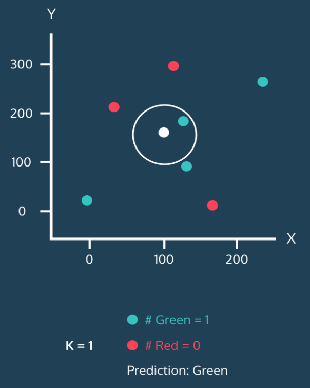


- 그런데 하얀 점 주위로 원을 그려놓았고, 이 원 안에는 1개의 이웃이 있다.

- 이렇게 원 안에 포함될 이웃의 개수를 k라고 생각하면 된다.

- 위 그림에서 k=1 이고, 하얀 점은 초록으로 분류 되는 것이다.

- 자, 이제 원을 확장해보자. k를 2로 조정해서 가장 가까운 이웃의 수를 2개까지 늘려보자.

  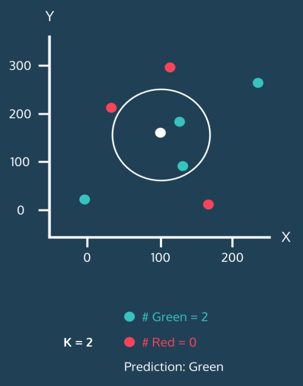

- 이웃 2개 모두 초록이다. 이번에도 하얀점은 초록으로 분류된다.

- 이번엔 가장 가까운 이웃 숫자를 3으로 늘려보자.

  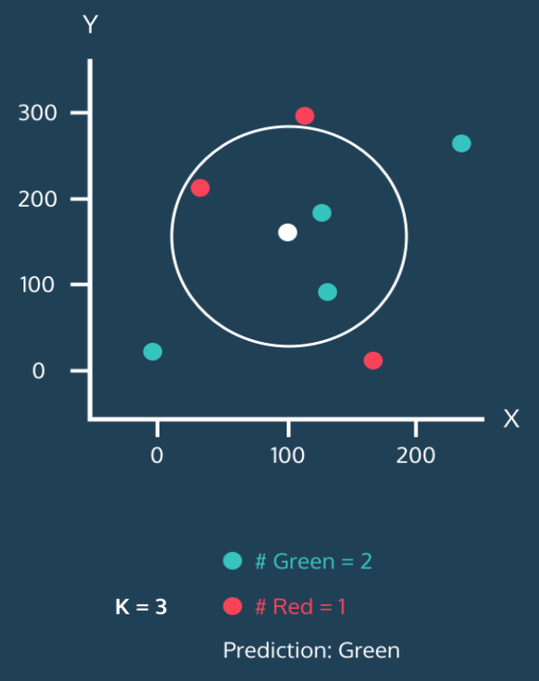

- 초록 2개, 빨강 1개다. 여전히 초록이 많기 때문에 하얀 점으로 초록으로 분류된다. 일종의 **다수결**이다.
- 가장 가까운 이웃의 숫자를 4로 늘려보자.

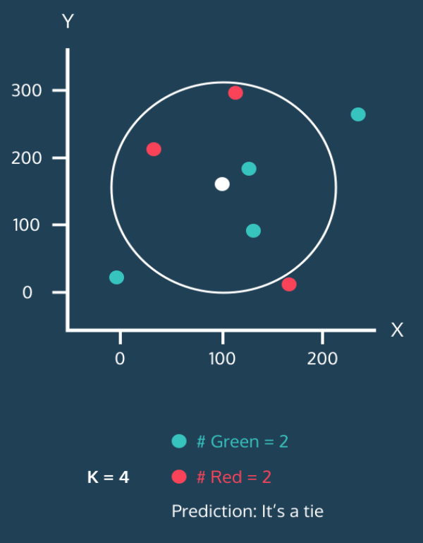


- 초록 2개, 빨강 2개 동률이 나왔다.

- 마지막으로 5개로 늘려보자.

  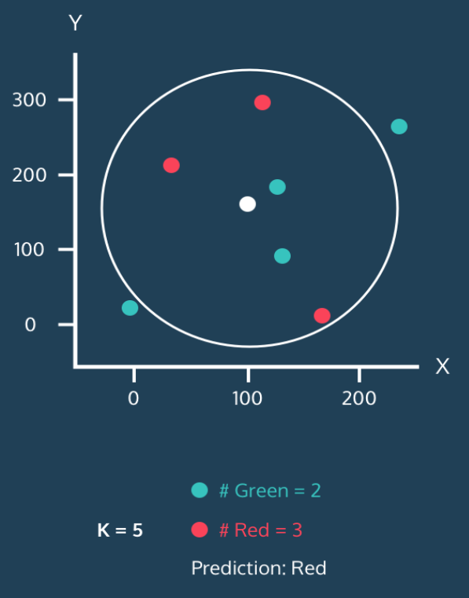

- 빨강색 3개, 초록색 2개가 나와서 하얀 점이 비로소 빨강으로 분류가 되었다.
- 이게 KNN 알고리즘의 핵심 개념이다. 이미 각 점들의 분류를 알고 있으면 새로운 점이 등장했을 때 그 점을 어디로 분류할지 정할 수 있는 것이다.


### 2. KNN 알고리즘에 대해 몇가지 생각해볼 문제


#### 1. 정규화(Normalization)

- 위 예제는 x와 y값이 적당히 잘 퍼져 있으니 문제가 안드러나지만, 실제 데이터는 그렇지 않을 수 있다.
- 예를 들어 성인 남녀의 연봉과 시력을 특성으로 생각해보자.
- 연봉 단위가 원화면 편차가 천만 단위를 넘어가겠지만, 시력은 소수점까지 따져가면서 최대 값소가 최소값의 편차가 10 미만? 일 것이다.
- 아무튼 그걸 똑같은 기준으로 고려해서 반영하면 연봉이 압도적으로 반영이 되기 때문에 터무니 없는 결론이 나올 수 있다.
- 그래서 KNN 알고리즘을 사용할 때 모든 특성들을 모두 고르게 반영하기 위해 **정규화(Normalize)**를 해주곤 한다. 정규화 방법은 여러가지가 있는데, 가장 널리 사용되는 방법은 아래 두 가지 방법이다.
  - 최소값을 0, 최대값을 1로 고정한 뒤 모든 값들을 0과 1사이 값으로 변환하는 방법
  - 평균과 표준편차를 활용해서 평균으로부터 얼마나 떨어져 있는지 z-점수로 변환하는 방법

- 이 외에도 다른 방법들도 있고, 각각의 장단점이 있지만 보통 위 방법을 적절히 사용해서 특성들을 정규화 해주면 어느정도 해결된다.


#### 2. K개수 선택

- 또 다시 고려할 중요한 문제는 **K를 몇으로 정할 것인가**이다.
- 이건 모든 값을 실제로 테스트하면서 분류 정확도(Accuracy)를 계산하는 과정에서 단서를 찾을 수 있다.


##### K가 너무 작을 때 : Overfitting

- 극단적으로 K=1 이라고 하자. 그러면 분류 정확도가 상당히 낮을 수 밖에 없다.

- 시야가 좁아지는 거고, 아주 근처에 있는 점 하나에 민감하게 영향을 받기 때문이다.

- 이를 **overfitting(과적합)**이라고 한다.

- KNN 알고리즘에서는 주변 다른 이웃들 까지 충분히 고려하지 않았을 때 오버피팅이 발생한다.

- 그래서 하나의 이상치(outlier)가 있을 경우 근처에 있는 점의 레이블이 그 이상치에 의해 결정 될 수 있다. 

- 아래의 그림을 보자.

  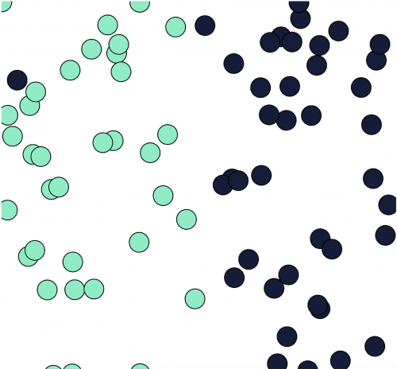

- 그림 왼쪽 상단의 진한 파란색 점은 이상치인 것으로 보인다. 만약 K=1인 경우 그 근처에 데이터가 위치하면 녹색으로 분류하지 않고 이상치를 따라 진한 파란색으로 분류되어 버린다.

##### K가 너무 클 때 :Underfitting

- 반면에 **K가 너무 큰 경우**에는 **underfitting(과소적합)**이 발생한다.
- 예를 들어 학습 세트에 100개의 점이 있고 K=100으로 설정했다고 극단적으로 가정해보자.
- 그러면 모든 점이 결국 동일한 방힉으로 분류될 거다. 점 사이의 거리는 의미가 없어진다.
- K가 너무 크면 분류기가 학습 데이터를 충분히 세세하게 살펴보지 못한다는 뜻이다.


---

# SVM(Support Vector Machine)

- **SVM(Support Vector Machine)**은 분류 과제에서 사용할 수 있는 강력한 머신러닝 지도학습 모델이다.


## 1. 서포트 벡터 머신이란

- **서포트 벡터 머신(이하 SVM)**은 **결정 경계(Decision Boundary)**, 즉 분류를 위한 기준 선을 정의하는 모델이다.
- 그래서 분류되지 않은 새로운 점이 나타나면 경계의 어느 쪽에 속하는지 확인해서 분류 과제를 수행할 수 있게 된다.
- 결국 이 **결정 경계**라는 걸 어떻게 정의하고 계산하는지 이해하는 게 중요하다.

- 아래의 예시를 보면, 만약 데이터에 2개 속성(feature)만 있다면 **결정 경계**는 이렇게 간단한 선 형태가 될 것이다.

  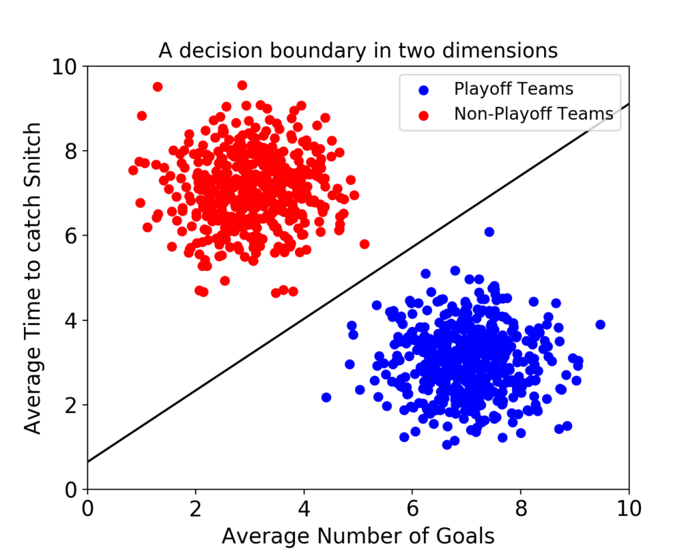

- 그러나 속성이 3개로 늘어난다면 이렇게 3차원으로 그려야 한다.

  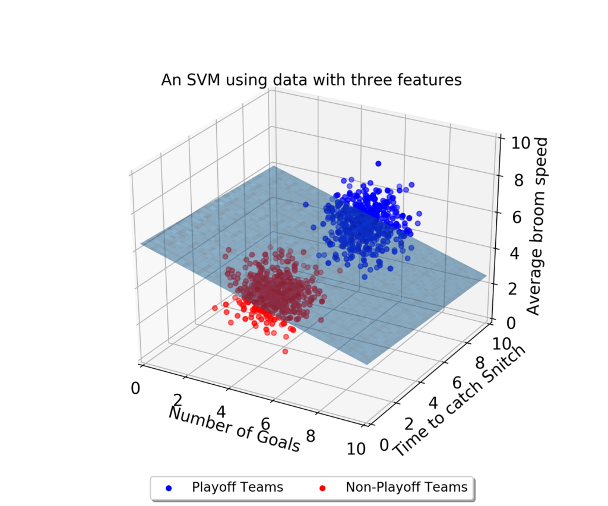

- 그리고 이 때의 **결정 경계**는 '선'이 아닌 '평면'이 된다.
- 우리가 이렇게 시각적으로 인지할 수 있는 범위는 딱 3차원까지다.
- 차원, 즉 속성의 개수가 늘어날수록 당연히 복잡해 질 것이다.
- **결정 경계**도 단순한 평면이 아닌 고차원이 될 텐데 이를 **"초평면(hyperplane)"**이라고 부른다.


### 최적의 결정 경계(Decision Boundary)

- 결정 경계는 무수히 많이 그을 수가 있다. 어떤 경계가 좋은 경계일까?

- 아래의 그림을 보자.

  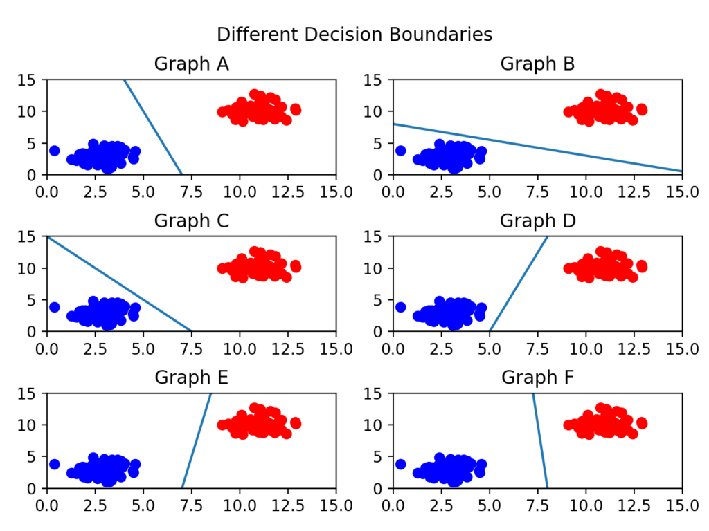

- 어떤 그래프가 제일 위태로워 보이는가?

  - C를 보면 선이 파란색 부류와 너무 가까워서 아슬아슬해 보인다.

- 그렇다면 어떤 결정 경계가 가장 적절해 보이는가?

  - F다. 두 클래스(분류) 사이에서 가장 거리가 멀기 때문이다.

- 이제 **결정 경계는 데이터 군으로부터 최대한 멀리 떨어지는게 좋다**는 걸 알았다.

- 실제로 SVM이라는 이름에서 **Support Vectors는 결정 경계와 가가이 있는 데이터 포인트들을 의미**한다.

- 이 데이터들이 경계를 정의하는 결정적인 역할을 하는셈이다.


### 마진(Margin)

- **마진(Margin)은 결정 경계와 서포트 벡터 사이의 거리**를 의미한다.

- 아래 그림을 보자.

  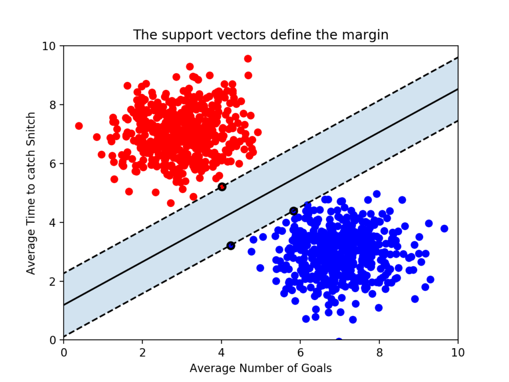

- 가운데 실선이 하나 그어져 있는데, 이게 바로 ``결정 경계``가 된다.

- 그리고 그 실선으로부터 두 검은 점선이 있는데, 빨간점이 1개, 파란점이 2개까지 영역을 두고 점선을 그어 놓았다.

- 점선으로부터 결정 경계까지의 거리가 바로 **마진(Margin)**이다.

- 여기서 일단 결론을 하나 얻을 수 있다. **최적의 결정 경계는 마진을 최대화한다.**

- 그리고 위 그림에서는 x축과 y축 2개의 속서을 가진 데이터로 결정 경계를 그었는데, 총 3개의 데이터 포인트(서포트 벡터)가 필요했다.

- 즉, **n개 속성을 가진 데이터에는 최소 n+1개의 서포트 벡터가 존재한다**는 걸 알 수 있다.

- 대부분의 머신러닝 지도 학습 알고리즘은 학습 데이터 모두를 사용하여 모델을 학습한다. 그런데 **SVM에서는 결정 경계를 정으히ㅏ는 게 결국 서포트 벡터이기 때문에 데이터 포인트 중에서 서포트 벡터만 잘 골라내면 나머지 쓸 데 없는 수 많은 데이터 포인트들을 무시할 수 있다. 그래서 매우 빠르다.**


### 이상치(Outlier)를 얼마나 허용할 것인가

- SVM은 데이터 포인트들을 올바르게 분리하면서 **마진의 크기를 최대화**해야 하는데, 결국 **이상치(outlier)**를 잘 다루는 게 중요하다.

- 아래 그림을 보자. 선을 살펴보기에 앞서 왼쪽에 혼자 튀어 있는 파란 점과, 오른쪽에 혼자 튀어 있는 빨간 점이 있다는 걸 봐두자. 누가 봐도 **아웃라이어**다.

  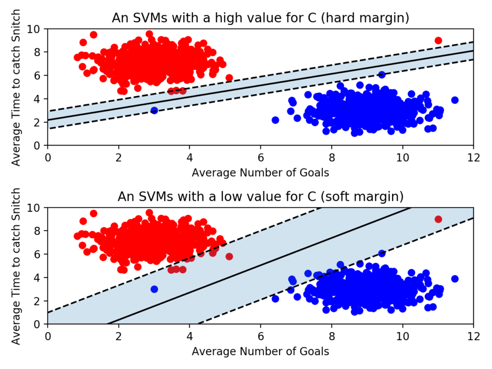

- 이제 위 아래 그림을 좀 더 자세히 비교해보자.

- 위의 그림은 아웃라이어를 허용하지 않고 기준을 까다롭게 세운 모양이다. 이걸 **하드 마진(hard margin)**이라고 부른다. 그리고 서포트 벡터와 결정 경계 사이의 거리가 매우 좁다. 즉 마진이 매우 작아진다. 이렇게 개별적인 학습 데이터들을 다 놓치지 않으려고 아웃라이어를 허용하지 않은 기준으로 결정 경계를 정해버리면 **오버피팅(overfitting)** 문제가 발생할 수 있다.
- 아래 그림은 아웃라이어들이 마진 안에 어느정도 포함되도록 너그럽게 기준을 잡았다. 이걸 **소프트 마진(soft margin)**이라고 부른다. 이렇게 너그럽게 잡아 놓으니 서포트 벡터와 결정 경계 사이의 거리가 멀어졌다. 즉, 마진이 커진다. 대신 너무 대충대충 학습하는 꼴이라 **언더피팅(underfitting)** 문제가 발생할 수 있다. 


### 파라미터 C

- 그리고 **scikit-learn**에서는 **SVM 모델이 오류를 어느정도로 허용할 것 인지 파라미터 C를 통해 지정할 수 있다.**(기본 값은 1이다.)

  ```python
  classifier = SVC(C = 0.01)
  ```

- **``C``값이 클수록 하드마진(오류 허용 안 함), 작을수록 소프트마진(오류를 허용함)**이다.

- 당연히 ``C``의 최적 값은 데이터에 따라 다르다. 결국 여러가지 C값을 넣어보면서 모델을 검증 하는 수 밖에 없다.


### 커널(Kernel)

- 지금까지는 선형으로 결정 경계를 그을 수 있는 형태의 데이터 세트를 예시로 들었다. 그런데 만약 SVM이 선형으로 분리 할 수 없는 데이터 세트가 있다면 어떻게 해야 할까?

- 극단적인 예를 들어 아래와 같은 데이터가 있다고 해보자.

  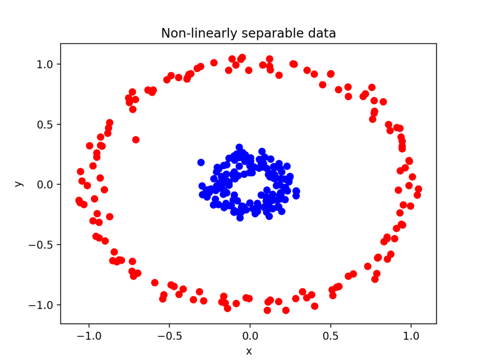

- 빨간색 점을 파란색 점과 분리하는 직선을 그릴수가 없다.
- 그러나 다행히도 scikit-learn 에서는 SVM 모델을 만들 때 ``kernel``을 지정하여 해결할 수 있다.
- 보통은 이렇게 선형(``'linear'``)으로 지정하지만 ``'ploy'`` 같은 걸 넣어 줄 수도 있다.
- 


---

## Decision Tree (의사결정 나무)

- **의사결정 나무(Decision Tree)**는 각 데이터들이 가진 속성들로부터 패턴을 찾아내서 분류 과제를 수행할 수 있도록 하는 지도학습 머신러닝 모델이다.


### 의사결정 나무란 무엇인가?

- 예를들어 시험에서 A를 받은 데이터를 초록색 동그라미로 표현했다고 하자.

  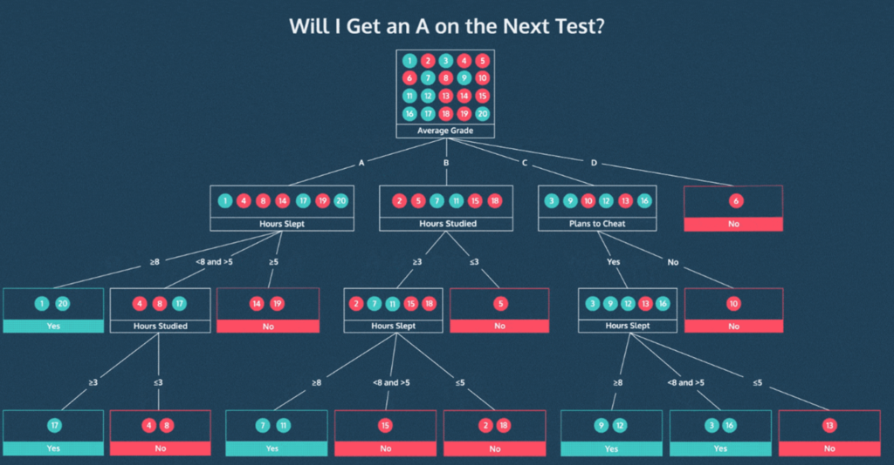

- 의사 결정 나무는 대체 어떤 사람들이 그 A를 받았는지 나름의 기준이나 체크리스트(?) 같은 걸 만들어 준다.

- 그래서 새로운 데이터가 들어오면 그 체크리스트를 바탕으로 하나씩 질문하고(예를 들면 잠을 몇시간 잤냐? 공부는 몇시간 했냐 등) 거기서 나온 답에 대한 다음 나무 줄기를 따라가다가 결국에는 '이건 어떤 레이블이겠구나'라고 분류를 해줄 수 있게 되는 거다.

- 일종의 스무고개 같은 거라 생각하면 편하다. 그래서 질문을 잘 설계하는 것이 중요하다. 이를 위해 고려할 개념들을 하나씩 살펴보자.


### 지니 불순도(Gini Impurity)

- 어떤 질문이 좋은 질문일까?

  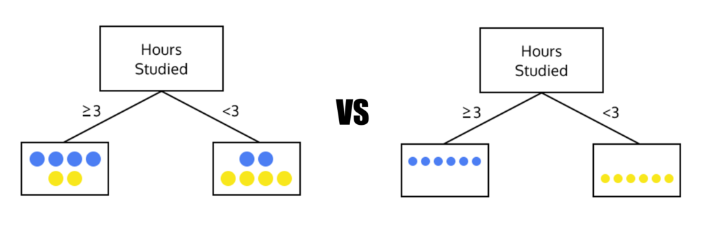

- 왼쪽의 그림은 데이터 분할이 깔끔하지 않다. 우리의 목표는 오른쪽 그림처럼 불순물(?) 없이 완전 깔끔하게 골라내는 거다.
- 여기서 불순물이라는 표현을 썼는데, 이 불순물이 어느정도 포함되어 있는지 확인할 수 있는 지표로 **지니 불순도(Gini Impurity)** 값을 확인해 볼 수 있다.

- 계산법은 1에서 '전체 데이터 개수 중 각 레이블이 차지하는 개수의 비율'을 제곱해서 빼주면 된다.

- 예를 들어 총4개 데이터 세트에서 레이블 A가 3개, B가 1개 포함되어 있다면 이렇게 계산하면 된다.

  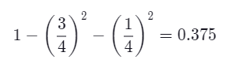

- 만약 단 하나의 레이블로 퓨어하게 구성되어 있다면 **지니 불순도** 값은 0이 될 것이다.

- 결국 좋은 질문을 거쳐 분할된 데이터 세트는 지니 불순도 값이 작다는 것을 알 수 있다.


### 정보 획득량(Information Gain)

- 지니 불순도를 구할 수 있다면, 이를 통해 어떤 질문에서 얻을 수 있는 **정보 획득량(Information Gain)**을 계산할 수 있다.

  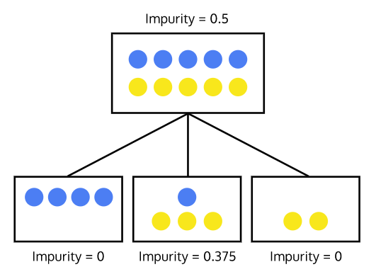

- 위처럼 불순도 0.5의 데이터 세트를 불순도 각각 0, 0.375, 0을 가진 3개의 데이터 세트로 분할했을 때, 여기서 얻은 정보 획득량은 다음과 같이 계산 할 수 있다.

- Information Gain = 0.5 - (0 + 0.375 + 0) = 0.125

- 그냥 이전 단계 불순도에서 다음 단계의 불순도 합을 빼주는 거다. 즉, **분할된 데이터 세트들의 불순도가 작을수록 정보 획득량은 증가한다.**

- 그러나 이렇게 하위 데이터 세트들의 불순도만으로는 정보 획득량을 설명하기에는 부족한 측면들이 있다. 그래서 **가중치(weight)**를 적용하곤 한다.


#### Weighted Information Gain

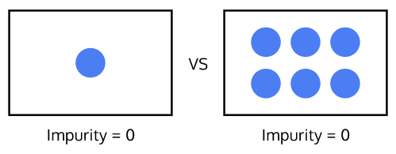

- 두개의 데이터 세트 모두 불순도는 0이지만, 오른쪽 데이터 세트가 더 의미있는 것처럼 보인다.

- 그 이유는 뭘까? **데이터 개수가 충분히 많고, 따라서 이 분류가 우연이 아니라고 확신할 수 있기 때문**이다.

- 이제 단순한 불순도뿐만 아니라 데이터 세트의 크기도 중요하다는 걸 알았으니 **생성된 데이터 세트의 크기에 따라 가중치가 적용된 정보 획득량(Weighted Information Gain)**을 계산해 볼 수 있다.

  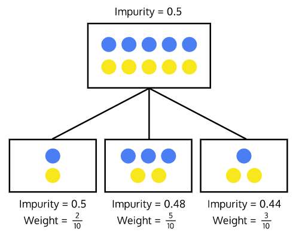

- 이렇게 **분할하기 전 데이터에 비해 분할 후 생성된 데이터의 크기(비율)에 따라 가중치를 구해놓고 이를 불순도에 곱해서 정보 획득량을 구하면 된다.**

- Information Gain = 0.5 - ((2/10) * 0.5 + (5/10) * 0.48 + (3/10) * 0.44) = 0.026

- **데이터 세트의 크기가 작을 수록 그 불순도의 영향력도 작아진다.**


### 재귀적(Recursive) 트리 빌딩

- 의사결정 트리에서는 **정보 획득량(Information Gain)**이 큰 순서대로 질문을 배치하는 게 중요하다.
- 그리고 그 속성에 대해 어느 기준으로 나누는 게 좋을지 반복적으로 적용해보면서 최적의 트리를 찾게 된다. 이를 **재귀(recursive) 알고리즘** 이라고 한다.
- 아무튼 이렇게 반복하면서 찾으면서 더 이상 정보 획득량이 없을 때 재귀(recursion)를 중단하게 된다.


---


## Random Forest (랜덤 포레스트)

- 의사 결정 트리의 오버피팅 한계를 극복하기 위한 전략으로 **랜덤 포레스트(Random Forest)** 방법을 사용한다.


### Random Forest란

- **랜덤 포레스트는 훈련을 통해 구성해 놓은 다수으 ㅣ나무들로부터 분류 결과를 취합해서 결론을 얻는, ** 일종의 **인기 투표**(?) 같은 것.

  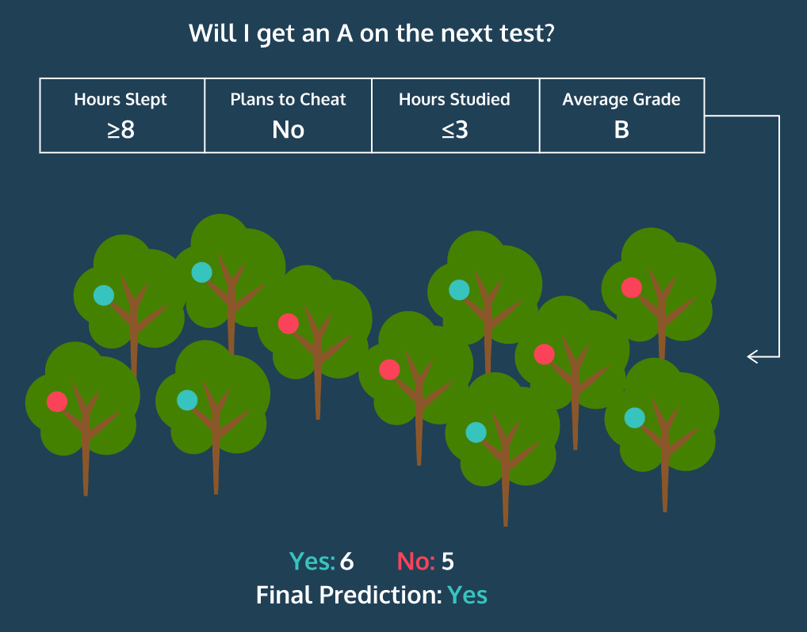


- 물론 몇몇의 나들이 오버피팅을 보일 순 있지만 다수의 나무를 기반으로 예측하기 때문에 그 영향력이 줄어들게 되어 좋은 일반화 성능을 보인다.
- 이렇게 좋은 성능을 얻기 위해 다수의 학습 알고리즘을 사용하는 걸 **앙상블(ensemble) 학습법**이라고 부른다.
- 일단 랜덤 포레스트에서 각 나무들을 어떻게 생성하는지 알아야 한다. 결론부터 얘기하면 배깅(bagging)이라는 프로세스를 통해 나무를 만든다.


#### 배깅(bagging)

- 학습 데이터 세트에 총 1000개의 행이 있다고 해보자. 그러면 임의로 100개씩 행을 선택해서 의사결정 트리를 만드는 게 **배깅(bagging)**이다. 그리고 이 때 **중복을 허용**해야 한다는 걸 기억하자.


#### Bagging Features

- 여기에 **트리를 만들 때 사용될 속성(feature)들을 제한**함으로써 각 나무들에 다양성을 줘야 한다.

- 원래는 트리를 만들 때 모든 속성들을 살펴보고 정보 획득량이 가장 많은 속성을 선택해서 그걸 기준으로 데이터를 분할했다.
- 그러나 이제는 **각 분할에서 전체 속성들 중 일부만 고려하여 트리를 작성하도록** 하는 전략이다.
- 예를 들면 총 25개의 속성이 있는데, 그 중 5개의 속성만 뽑아서 살펴본 후 그중 정보 획득량이 가장 높은 걸 기준으로 데이터를 분할 하는 것이다.
- 그렇다면 몇개씩 속성을 뽑는 게 좋을까? 위 예처럼 총 속성이 25개면 5개, 즉 **전체 속성 개수의 제곱근 만큼 선택**하는게 가장 좋다고, 경험적으로 그렇게 나타난다고 한다.
- 이제 서로 다른 트리를 만들 수 있게 되었으니 이것들을 모아 '숲'을 이루도록 하면 되는 거다.


---

## K-Means

- 비지도 학습 알고리즘 **K-Means 클러스터링**


### 클러스터링, 군집화란 무엇인가

- 만약 우리가 다루는 데이터에 "레이블"이 붙어 있다면 지도학습, 즉 미리 가지고 있는 데이터와 레이블을 기반으로 예측이나 분류를 수행하는 모델을 만들 수 있다.
- 그러나 실제로는 레이블(분류)이 없는 경우가 더 많다.
- 물론 이렇게 별도의 **레이블이 없는 데이터 안에서 패턴과 구조를 발견하는 비지도 학습**도 머신러닝의 큰 축이고, 그 중 가장 대표적인 비지도 학습 기술이 바로 **Clustering(군집화)**이다.
- 참고로 **Classification(분류)**는 미리 레이블이 붙어 있는 데이터들을 학습해서 그걸 바탕으로 새로운 데이터에 대해 분류를 수행하지만, **Clustering(군집화)**는 레이블을 모르더라도 그냥 비슷한 속성을 가진 데이터들끼리 묶어주는 역할이다.
- **Clustering(군집화)를 사용하는 예**로 아래와 같은 것들을 들 수 있다.
  - 추천 엔진 : 사용자 경험을 개인화하기 위해 비슷한 제품 묶어주기
  - 검색 엔진 : 관련 주제나 검색 결과 묶어주기
  - 시장 세분화(segmentation) : 지역, 인구 통계, 행동에 따라 비슷한 고객들 묶어주기


### 군집화의 목표

- 군집화의 목표는 **서로 유사한 데이터들을 같은 그룹으로, 서로 유사하지 않은 데이터는 다른 그룹으로 분리하는 것**이 된다.
- 그러면 자연스럽게 2개의 질문이 따라올 것이다.
  - **몇개의 그룹으로 묶을 것인가**
  - **데이터의 *유사도*를 어떻게 정의할 것인가 (유사한 데이터란 무엇인가)**
- 이 두 질문을 해결할 수있는 가장 유명한 전략이 바로 **K-Means** 알고리즘이다.


### K-Means 군집화의 원리

- "**K**"는 데이터 세트에서 찾을 것으로 예쌍되는 클러스터(그룹) 수를 말한다.
- "**Means**"는 각 데이터로부터 그 데이터가 속한 클러스터의 중심까지의 평균 거리를 의미한다. (이 값을 최소화 하는 게 알고리즘의 목표가 된다.)

- K-Means에서는 이걸 구현하기 위해 반복적인(iterative) 접근을 취한다.

  - 일단 K개의 임의의 중심점(centroid)을 배치하고
  - 각 데이터들을 가장 가까운 중심점으로 할당한다. (일종의 군집을 형성한다.)
  - 군집으로 지정된 데이터들을 기반으로 해당 군집의 중심점을 업데이트 한다.
  - 2,3번 단계를 수렴이 될 때까지, 즉 더이상 중심점이 업데이트 되지 않을 때까지 반복한다.

  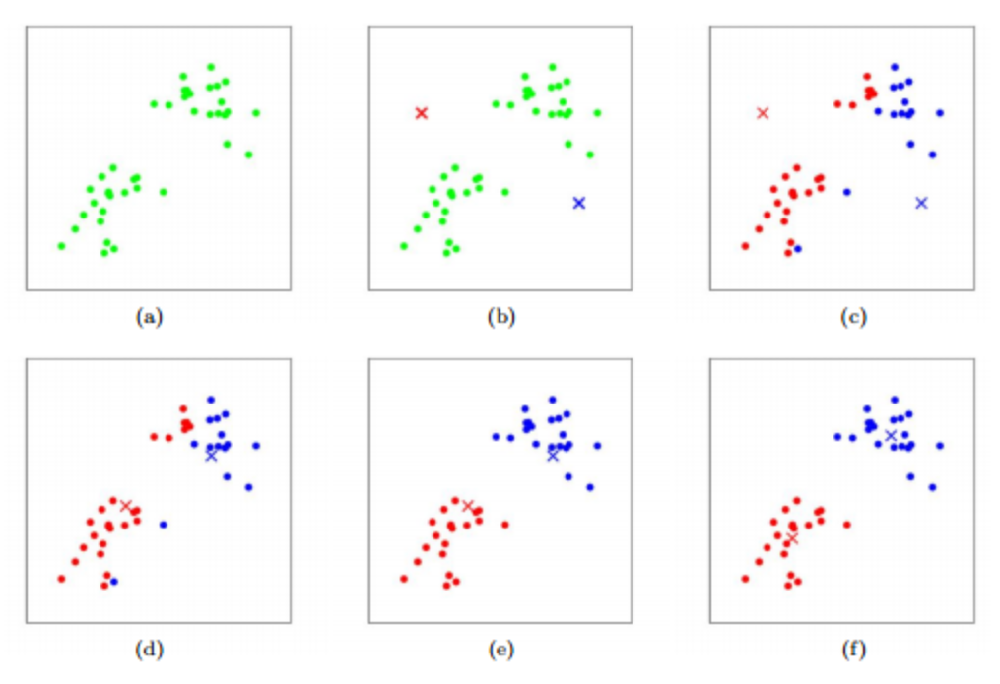

- 여기서 일단 k 값은 2다. 그래서 (b)에서 일단 중심점 2개를 아무데나 찍고, (c)에서는 각 데이터들을 두 개 점중 가까운 곳으로 할당한다.
- (d)에서는 그렇게 군집이 지정된 상태로 중심점을 업데이트 한다.
- 그리고 (e)에서는 업데이트 된 중심점과 각 데이터들의 거리를 구해서 군집을 다시 할당한다.
- 이걸 계쏙 반복해서 군집화를 해놓으면 새로운 데이터가 들어와도 그게 어떤 군집에 속할지 할당해줄 수 있게 되는 셈이다.
- 