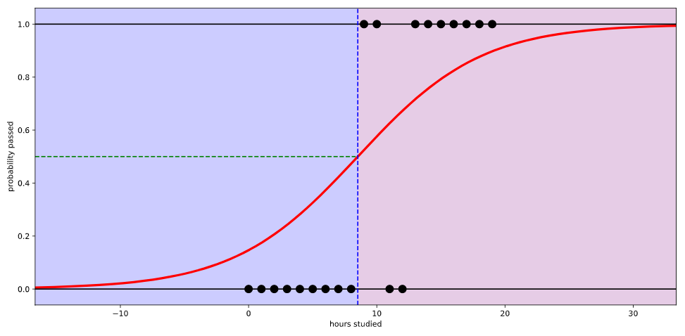

# 머신 러닝

## 머신러닝이란?

- 머신러닝은 기계를 가르친다는 뜻인데, 기게를 어떻게 가르칠 것인가에 따라 두 가지로 나눠서 생각 할 수있다.
  - **Supervised Learning (지도 학습)**
  - **UnSupervised Learning (비지도 학습)**

### 1. Supervised Learning (지도 학습)

- 지도 학습은 데이터에 레이블(정답)이 미리 정해져 있을 때 가능하다.
- 그래서 프로그램에 입력값을 주면 출력값을 기계가 예측해주는 거다.
- 지도 학습은 또 다시 **Regression(회귀)**와 **Classification(분류)**로 세분화 할 수있다.
- **Regression(회귀)** : 연속된 값, 수치, 즉 '얼마나'를 예측
- **Classification(분류)** : 연속적이지 않은 값, 다시 말해 '무엇'을 예측

### 2. Unsupervised Learning (비지도 학습)

- 비지도 학습은 레이블(정답)이 정해져 있지 않은 데이터를 기반으로 데이터의 고유한 구조나 패턴을 익히는 것.
  - **Clustering(군집화) ** : 데이터에서 패턴과 구조를 찾아 그룹을 지어줌

-  분류는 정답을 맞히는 거고 클러스터링은 비슷한 것들끼리 묶어주는 거다. 전혀 다른 거다.

---

## 머신러닝에서 학습세트, 평가세트를 나누는 이유와 방법

- 우리는 머신러닝을 통해서 예측이나 분류를 할 수있다. 그런데 이 예측이나 분류가 얼마나 정확한지 자문하는 것이 중요하다.
- 지도학습(Supervised learning)에서는 다행히도 이미 레이블링 된(정답이 있는) 데이터가 있기 때문에 그걸 활용해서 알고리즘의 정확도를 테스트 할 수 있다.
- 머신러닝 모델의 효과성을 검증하기 위해 데이터를 나눌 때 보통 아래와 같이 세 개의 개념을 이해하면 된다.
  - **Training Set (학습 세트)**
  - **Validation Set (검증 세트)**
  - **Test Set(평가 세트)**
- 이 중 검증 세트와 평가 세트는 사실 유사한 개념이다.

### 학습 세트(Training Set)와 검증 세트(Validation Set)

- **학습 세트(Training Set)**는 말그대로 **알고리즘이 학습할 데이터**다.
- 이 학습 데이터 세트를 사용하여 모델을 학습시키고 나면 이후에는 **검증 세트(Validation Set)를 통해 모델의 예측/분류 정확도를 계산**할 수 있다.
- 사실 모든 검증 세트에 대한 **실제 레이블, 즉 정답을 알고 있지만 그렇지 않은 척** 하는 셈이다.
- 그래서 새로운 데이터인 것처럼 분류/예측 모델에 입력해준다.
- 실제로 학습 시킬 때 이 데이터들을 배제했기 때문에 가능하다.
- 예측/분류된 값을 받아서 실제로 갖고 있던 답과 비교하기만 하면 결국 **정확도(Accuracy)**를 알 수 있는 거다.

- 물론 여기서 말하는 **정확도(Accuracy)**가 만능의 지표는 아니다.
- 머신러닝 알고리즘의 효과를 판단할 때 오히려 **정밀도(precision)**과 **재현율(recall)**, 그리고 정확률과 정밀도의 조화평균인 **F1 점수**를 확인하는 등의 방법도 있다.

### 어떻게 데이터 세트를 나눌 것인가 

- 학습세트 vs 검증세트를 어떤 비율로 분할할지 판단하기가 쉽지 않다.
- 학습 세트가 너무 작으면 알고리즘이 효과적으로 학습하기에 충분치 않을 수 있다.
- 반면, 검증 데이터가 너무 작으면 이를 통해 계산한 정확도(Accuracy), 정밀도(precision), 재현율(recall), F1 점수가 서로 차이가 많이나서 신뢰하기 어려울 수 있다.
- 일반적으로 **전체 데이터 중 80%를 학습으로, 20%를 검증으로 사용하는 것이 좋다**고 한다.
- 

---

## 선형회귀 (Linear Regression)

### 1. 선형회귀란

머신 러닝의 가장 큰 목적은 실제 데이터를 바탕으로 모델을 생성해서 다른 입력 값을 넣었을 때 발생하는 결과 값을 예측하는데에 있다.

이때 우리가 찾아낼 수 있는 가장 직관적이고 간단한 모델인 **선(line)**이다. 그래서 데이터를 놓고 그걸 가장 잘 설명할 수있는 선을 찾는 분석 방법을 **선형 회귀(Linear Regression)** 분석이라 부른다.

예를 들어 키와 몸무게를 데이터를 다음과 같이 점을 찍고 선으로 표현하면 특정 인의 키를 바탕으로 몸무게를 예측할 수 있다.

직선의 그래프는 **y = mx + b**로, 선형 회귀 분석의 우리가 가진 데이터로 최선의 m과 b를 구하는 것이다.

### 2. 선형회귀에서 발생하는 오차, 손실(Loss)

- 데이터들을 놓고 선을 긋는 다는 건, 결국 어림잡아 본다는 뜻이다.

- 그러면 당연히 선은 실제 데이터와 약간의 차이가 발생하는데, 이 오차를 앞으로 **손실(Loss)**라 부르자.

- 아래 그림을 보면 A는 3, B는 1만큼 **손실(Loss)**이 발생했다.

  

- 그런데 엄밀히 보면 + 혹은 - 방향을 고려하지 않고 얘기한 것이다.
- 선과 실제 데이터 사이에 얼마나 오차가 있는지 구하려면 **양수, 음수 관계 없이 동일하게 반영되도록 모든 손실에 제곱**을 해주는 게 좋다. (예제의 오차를 다시 제곱된 거리로 표현하면 A는 9, B는 1)
- 이런 방식의 손실을 구하는 걸 **평균 제곱 오차(mean squared error, MSE)**라고 부른다. Loss를 구할 때 가장 널리 쓰이는 방법이다.
- 아무튼 **결국 선형 회귀 모델의 목표는 모든 데이터로부터 나타나는 오차의 평균을 최소화 할 수 있는 최적의 기울기와 절편을 찾는 것이다.**

### 3. 손실을 최소화 하기 위한 방법, 경사하강법(Gradient Descent)

- 머신러닝에서 사용하는 모형은 매우 복잡하기 때문에 선형 회귀 분석에서도 최적의 기울기와 절편을 구할 수 있는 마땅한 방법이 없다.

- 그런데 그나마 단서가 있다면 위에서 설명한 손실(Loss)을 함수로 나타내면 이렇게 아래로 볼록한 모양이라는 것이다.

  

- 그래서 **일단 파라미터를 임의로 정한 다음에 조금씩 변화시켜가면 손실을 점점 줄여가는 방법으로 최적의 파라미터를 찾아간다.** 
- 이런 방법을 **경사하강법(Gradient Descent)** 이라 부른다.

### 4. 수렴(Convergence)

- 아무튼 선형 회귀 분석을 수행하면 기울기와 절편을 계속 변경해가면서 최적의 값을 찾게 될 텐데, 이걸 언제까지 할지 정해줘야 한다.

- 무작정 계속 시킬 수는 없으니까, 어차피 파라미터를 계속 조정 하다보면 어느정도 최적의 값으로 수렴(convergence)한다. 아래와 같은 모양으로.

  

- 위 그림을 보면 1000번 반복하니까 b값이 결국 약 47에 수렴하는 걸 알 수 있다. 그 이상 시도하는 건 별 의미가 없어진다.
- 이걸 우리가 어떻게 결정할까? 어차피 머신러닝 알고리즘이 알아서 잘 수렴할거니 걱정 말자.

### 5. 학습률(Learning Rate)

- 다만 우리는 **학습률(Learning Rate)**이라는 걸 정해줄 필요가 있다.

- 아래 그림을 보면 학습률이 너무 커서 파라미터를 듬성듬성 조정한다.

  

- 이렇게 **학습률을 크게 설정하면 최적의 값을 제대로 찾지 못한다.** 일을 대충하는 거다. 대신 일을 빨리 하긴 하겠지..
- 그렇다고 학습률을 적게 설정하면 최적의 값으로 수렴할 때 까지 시간이 오래 걸린다.
- 그래서 모델을 학습시킬 때는 최적의 학습률을 찾는게 중요하다.
- 효율적으로 파라미터를 조정하면서도 결국 최적의 값을 찾아 수렴할 수 있을 수준으로.

---

## Logistic Regression(로지스틱 회귀)

### 1. 로지스틱 회귀란 무엇인가

- **로지스틱 회귀(Logistic Regression)**는 회귀를 사용하여 데이터가 어떤 범주에 속할 확률을 0에서 1사이의 값으로 예측하고 그 확률에 따라 가능성이 더 높은 범주에 속하는 것으로 분류해주는 지도 학습 알고리즘

- 스팸 메일 분류기 같은 예시를 생각하면 쉽다.

- 어떤 메일을 받았을 때 그것이 스팸일 확률이 0.5 이상이면 spam으로 분류하고, 확률이 0.5보다 작은 경우 정상 메일로 분류하는 것이다.

- 이렇게 데이터가 2개의 범주 중 하나에 속하도록 결정하는 것을 **2진 분류(binary classification)** 이라고 한다.

- 예를 들어 어떤 학생이 공부하는 시간에 따라 시험에 합격할 확률이 달라진다고 해보자. **선형 회귀를 사용하면** 아래와 같은 그림으로 나타낼 수 있다.

  

- 공부한 시간이 적으면 시험에 통과 못하고, 공부한 시간이 만으면 시험에 통과한다는 식으로 설명할 수 있다.
- 그런데 이 회귀선을 자세히 살펴보면 **확률이 음과 양의 방향으로 무한대까지 뻗어 간다.** 
- 말 그대로 '선'이라서, 그래서 공부를 2시간도 안 하면 시험에 통과할 확률이 0이 안된다. 이건 말이 안된다.

- 만약 **로지스틱 회귀**를 사용하면 아래와 같이 나타 난다.

  

- 시험에 합격할 **확률이 0과 1사이의 값**으로 그려진다.
- 로지스틱 회귀에서는 데이터가 특정 범주에 속할 확률을 예측하기 위해 아래와 같은 단계를 거친다.
  1) 모든 속성(feature)들의 계수(coefficient)와 절편(intercept)을 0으로 초기화
  2) 각 속성들의 값(value)에 계수(coefficient)를 곱해서 **log-odds**를 구한다.
  3) **log-odds**를 **sigmoid 함수**에 넣어서 ``[0,1]`` 범위의 확률을 구한다.
  4) 