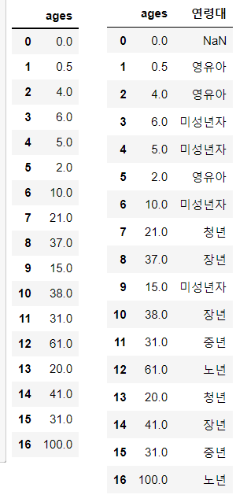

# Pandas Series, DataFrame 문법 정리


<h2>
   목차

1. [pd.Series(value,index)](#pdseriesvalueindex)
2. [시리즈명.index](#시리즈명index)
3. [시리즈명.index.name](#시리즈명indexname)
4. [시리즈명.values](#시리즈명values)
5. [value 값 접근](#value-값-접근)
6. [value 값 갱신](#value-값-갱신)
7. [value 값 추가](#value-값-추가)
8. [value 값 제거/삭제](#value-값-제거삭제)
9. [sum()](#sum)
10. [시리즈명.size](#시리즈명size)
11. [len(시리즈명)](#len시리즈명)
12. [시리즈명.shape](#시리즈명shape)
13. [시리즈명.unique()](#시리즈명unique)
14. [시리즈명.count()](#시리즈명count)
15. [시리즈명.mean()](#시리즈명mean)
16. [시리즈명.value_counts()](#시리즈명value_counts)
17. [pd.DataFrame([리스트1],[리스트2])](#pddataframe리스트1리스트2)
18. [pd.DataFrame(딕셔너리)](#pddataframe딕셔너리)
19. [pd.read_csv()](#pdread_csv)
20. [df.head(n)](#dfheadn)
21. [df.tail(n)](#dftailn)
22. [df.columns](#dfcolumns)
23. [df.index](#dfindex)
24. [df.index.name](#dfindexname)
25. [df.values](#dfvalues)
26. [df.describe()](#dfdescribe)
27. [df value값 갱신](#df-value값-갱신)
28. [df value값 추가](#df-value값-추가)
29. [df value값 제거/삭제](#df-value값-제거삭제)
30. [np.random.seed(n)](#nprandomseedn)
31. [np.random.randint()](#nprandomrandint)
32. [df.count()](#dfcount)
33. [패키지명.load_dataset()](#패키지명load_dataset)
34. [시리즈.value_counts(normalize=True)](#시리즈value_countsnormalizetrue)
35. [시리즈.sort_index()](#시리즈sort_index)
36. [df.sort_values()](#dfsort_values)
37. [df.sort_index()](#dfsort_index)
38. [df.sum(axis=0/1)](#dfsumaxis01)
39. [df.mean() / max() / min()](#dfmean--max--min)
40. [df의 새로운 열과 행 추가](#df의-새로운-열과-행-추가)
41. [df.drop()](#dfdrop)
42. [df.dropna() / fillna()](#dfdropna--fillna)
43. [df.astype()](#dfastype)
44. [df.apply()](#dfapply)
45. [pd.cut()](#pdcut)
46. [pd.qcut()](#pdqcut)
47. [df.set_index()](#dfset_index)
48. [df.reset_index()](#dfreset_index)
49. [df.rename()](#dfrename)
50. [df.merge()](#dfmerge)
51. [df.merge(on 파라미터)](#dfmergeon-파라미터)
52. [df.merge(left/right_index)](#dfmergeleftright_index)
53. [pd.concat()](#pdconcat)
54. [df.pivot_table()](#dfpivot_table)
55. 
56. 
57. 
58. 
59. 
60. 
61. 
62. 
63. 
64. 
65. 
66. 
67. 


## pd.Series(value,index)


- **의미** 
  -  value와 index로 시리즈 생성
- **입력**
  - pd.Series([value1, value2, ...], index = [index1, index2, ...])
- **출력**
  - 1    10
    2    20
    3    30
    dtype: int64

```python
pd.Series([10,20,30], [1,2,3])
```


```python
1    10
2    20
3    30
dtype: int64
```


## 시리즈명.index

- **의미** 
  -   인덱스 접근
- **입력**
  -  시리즈명.index
- **출력**
  -  index(['홍길동', '이몽룡', '성춘향'])


```python
s.index
```

```python
Index(['홍길동', '이몽룡', '성춘향'], dtype='object')
```


## 시리즈명.index.name

- **의미** 
  -   시리즈의 인덱스에 이름 붙이기
- **입력**
  -  시리즈.index.name = '붙일 이름'
- **출력**
  -  이름
    홍길동	10
    이몽룡	20
    성춘향	30


```python
s.index.name = '이름'
s
```

```python
이름
홍길동    10
이몽룡    20
성춘향    30
dtype: int64
```


## 시리즈명.values

- **의미** 
  -  시리즈 value 값을 array 구조로 반환 
- **입력**
  -  시리즈명.values
- **출력**
  -  array([10,20,30])

```python
s.values
```

```
array([9904312, 3448737,  289045, 2466052], dtype=int64)
```


## value 값 접근

- **의미** 
  -   위치 인덱스 or 라벨 인덱스를 통해 value값 접근
- **입력**
  -  시리즈명[인덱스 위치 숫자] # 인덱스 타입이 정수면 위치 인덱스 사용 불가
  - 시리즈명['인덱스명']
  - 시리즈명.인덱스명
- **출력**
  -  value 값 출력

```python
s[0]
s['이몽룡']
s.서울
```


```python
96
100
9631482

```


## value 값 갱신

- **의미** 
  - 인덱스를 통한 value 값 갱신하기  
- **입력**
  -  시리즈명[index] = value
- **출력**
  -  갱신된 value 추출

```python
s
서울    9631482
부산    3393191
인천    2632035
대전    1490158

s['서울'] = 10000000

```


```python
서울	10000000
부산	3393191
인천	2632035
대전	1490158
```


## value 값 추가

- **의미** 
  - 인덱스를 통한 value 값 추가하기  
- **입력**
  -  시리즈명[index] = value
- **출력**
  -  추가된 value 추출

```python
s['대구'] = 1875000
s
```

```python
서울    10000000
부산     8630000
인천     2632035
대전     1490158
대구     1875000
```


## value 값 제거/삭제

- **의미** 
  - 인덱스를 통한 value 값 제거하기  
- **입력**
  -  del 시리즈명[index]
- **출력**
  -  시리즈 데이터 삭제

```python
del s['대전']
s
```

```python
서울    10000000
부산     8630000
인천     2632035
대구     1875000
```


## sum()

- **의미** 
  -   각 원소에 대해 조건식인 결과값이 True인 원소의 **개수** 계산
- **입력**
  -  (s0 >= 7).sum()
- **출력**
  -  시리즈 s0의 value값이 7이상인 조건에 True하는 원소의 개수

```python
s0
(s0 >= 7).sum() 
```

```python
1     0
2     1
3     2
4     3
5     4
6     5
7     6
8     7
9     8
10    9
dtype: int32

3
```


## 시리즈명.size

- **의미** 
  - NaN값 포함한 행 개수 반환  
- **입력**
  -  시리즈명.size
- **출력**
  -  행 개수 반환

```python
s1 = pd.Series([1,1,2,1,2,2,2,1,1,3,3,4,5,5,7,np.NaN])
s1
s1.size
```

```python
0     1.0
1     1.0
2     2.0
3     1.0
4     2.0
5     2.0
6     2.0
7     1.0
8     1.0
9     3.0
10    3.0
11    4.0
12    5.0
13    5.0
14    7.0
15    NaN
dtype: float64

16
```


## len(시리즈명)

- **의미** 
  -   NaN 값을 포함한 행 개수 반환
- **입력**
  - len(s1) 
- **출력**
  -  행 개수 반환

```python
s1
len(s1)
```

```python
0     1.0
1     1.0
2     2.0
3     1.0
4     2.0
5     2.0
6     2.0
7     1.0
8     1.0
9     3.0
10    3.0
11    4.0
12    5.0
13    5.0
14    7.0
15    NaN
dtype: float64
    
16
```


## 시리즈명.shape

- **의미** 
  - 튜플 형태로 (행,열) 크기 확인
- **입력**
  -  s1.shape
- **출력**
  -  (행,열)

```python
s1
s1.shape
```

```python
0     1.0
1     1.0
2     2.0
3     1.0
4     2.0
5     2.0
6     2.0
7     1.0
8     1.0
9     3.0
10    3.0
11    4.0
12    5.0
13    5.0
14    7.0
15    NaN
dtype: float64
    
(16,)
```


## 시리즈명.unique()

- **의미** 
  -   중복값을 제거한 value 값을 array 형태로 반환
- **입력**
  -  s1.unique()
- **출력**
  -  array([ 1.,  2.,  3.,  4.,  5.,  7., nan])

```python
s1
s1.unique()
```

```python
0     1.0
1     1.0
2     2.0
3     1.0
4     2.0
5     2.0
6     2.0
7     1.0
8     1.0
9     3.0
10    3.0
11    4.0
12    5.0
13    5.0
14    7.0
15    NaN
dtype: float64
    
aarray([ 1.,  2.,  3.,  4.,  5.,  7., nan])
```


## 시리즈명.count()

- **의미** 
  -   NaN 값을 제거한  행(value) 개수 
- **입력**
  -  s1.count()
- **출력**
  -  행 개수 반환

```python
s1
s1.count()
```

```python
0     1.0
1     1.0
2     2.0
3     1.0
4     2.0
5     2.0
6     2.0
7     1.0
8     1.0
9     3.0
10    3.0
11    4.0
12    5.0
13    5.0
14    7.0
15    NaN
dtype: float64
    
15
```


## 시리즈명.mean()

- **의미** 
  -   NaN 값을 제외시키고 평균값 계산
  - array.mean()은 NaN 값이 있으면 계산불가 (NaN 반환)
- **입력**
  -  시리즈명.mean()
- **출력**
  -  NaN 값을 제외한 평균값

```python
a = np.array([1,2,3,4,5,np.NaN]) # 결측치 포함
b = pd.Series(a)
b.mean()
```

```python
3.0
```


## 시리즈명.value_counts()

- **의미** 
  -   value 값들이 같은 값끼리 인덱스가 되고, 그 개수가 value값으로 세서 반환
- **입력**
  -  s1.value_counts()
- **출력**
  -  1.0    5
    2.0    4
    3.0    2
    5.0    2
    7.0    1
    4.0    1
    dtype: int64

```python
s1
s1.value_counts()
```

```python
0     1.0
1     1.0
2     2.0
3     1.0
4     2.0
5     2.0
6     2.0
7     1.0
8     1.0
9     3.0
10    3.0
11    4.0
12    5.0
13    5.0
14    7.0
15    NaN
dtype: float64
1.0    5
2.0    4
3.0    2
5.0    2
7.0    1
4.0    1
dtype: int64
```


## pd.DataFrame([리스트1],[리스트2])

- **의미** 

  -   리스트로 데이터프레임 생성

- **입력**

  -  pd.DataFrame(['a','b','c'],['a','a','g'])

- **출력**

  -  ```python
     	0	1	2
     0	a	b	c
     1	a	a	g
     ```

```python
df = pd.DataFrame([['a','b','c'],['a','a','g']])
df
```

```python
	0	1	2
0	a	b	c
1	a	a	g
```


## pd.DataFrame(딕셔너리)

- **의미** 

  -   딕셔너리로 데이터 프레임 생성

- **입력**

  -  pd.DataFrame({'A':[90,80,70],

    ​							'B':[85,98,75]},

    ​							index=[0,1,2])

- **출력**

  -  

```python
df1= pd.DataFrame({'A':[90,80,70],
                   'B':[85,98,75],
                   'C':[88,99,77],                   
                   'D':[87,89,86]},
                 index=[0,1,2])
df1
```

```python
	A	B	C	D
0	90	85	88	87
1	80	98	99	89
2	70	75	77	86
```


## pd.read_csv()

- **의미** 
  -   csv 파일 불러오기
- **입력**
  -  train_data = pd.read_csv('경로', index_col ='인덱스 사용할 column', usecols ='로딩하고 싶은 columns')
- **출력**
  -  csv 파일 출력

```python
train_data = pd.read_csv('../data/train.csv', 
                         index_col = 'PassengerId',
                        usecols=['PassengerId', 'Survived', 'Pclass', 'Name'])
train_data
```

```python

```


## df.head(n)

- **의미** 
  -   데이터 프레임의 처음 n행 만큼 출력, n생략하면 5행
- **입력**
  -  train_data.head(1)
- **출력**
  -  

```python
train_data.head(1)
```

```python

```


## df.tail(n)

- **의미** 
  -   데이터 프레임의 마지막 n행 만큼 출력, n 생략하면 5행
- **입력**
  -  train_data.tail(1)
- **출력**
  -  

```python
train_data.tail(1)
```

```python

```


## df.columns

- **의미** 
  -   데이터 프레임의 컬럼명(열 인덱스) 확인
- **입력**
  -  df3.columns
- **출력**
  -  Index(['지역', '2015', '2010', '2005', '2000', '2010-2015 증가율'], dtype='object')

```python
df3.columns
```

```python
Index(['지역', '2015', '2010', '2005', '2000', '2010-2015 증가율'], dtype='object')
```


## df.index

- **의미** 
  -   데이터 프레임의 인덱스(행 인덱스) 확인
- **입력**
  -  df3.index
- **출력**
  -  Index(['서울', '부산', '인천', '대구'], dtype='object')

```python
df3.index
```

```python
Index(['서울', '부산', '인천', '대구'], dtype='object')
```


## df.index.name

- **의미** 
  -   데이터프레임의 행 인덱스 이름 설정
- **입력**
  -  df3.index.name = '도시'
- **출력**
  -  

```python
df3.index.name = '도시'

```

```python

```


## df.values

- **의미** 
  -   데이터 프레임의 data 값 추출
- **입력**
  - df3.values
  - df3.values[0]
- **출력**
  - array 형태로 출력 

```python
df3.values # np.array 형태
df3.values[0]
```

```python
array([['수도권', 9904312, 9631482, 9762546, 9853972, 0.0283],
       ['경상권', 3448737, 3393191, 3512547, 3655437, 0.0163],
       ['수도권', 2890451, 2632035, 2517680, 2466338, 0.0982],
       ['경상권', 2466052, 2000002, 2456016, 2473990, 0.0141]], dtype=object)
array(['수도권', 9904312, 9631482, 9762546, 9853972, 0.0283], dtype=object)
```


## df.describe()

- **의미** 
  - 데이터 프레임의 기본 통계량 출력  
- **입력**
  - 
- **출력**
  - 

```python

```

```python
```


## df value값 갱신

- **의미** 
  -   인덱스 값을 통해 value 값 갱신
- **입력**
  - df[열이름(key)] = value
- **출력**
  - 갱신된 value 값

```python
df3['2010-2015 증가율']
df3['2010-2015 증가율'] * 100
```

```python
도시
서울    0.0283
부산    0.0163
인천    0.0982
대구    0.0141
Name: 2010-2015 증가율, dtype: float64
도시
서울    2.83
부산    1.63
인천    9.82
대구    1.41
Name: 2010-2015 증가율, dtype: float64
```


## df value값 추가

- **의미** 
  -   인덱스 값을 통해 value 값 추가
- **입력**
  - df[열이름(key)] = value
- **출력**
  - 새로운 열 추가

```python
df3['2005-2015 증가율'] =((df3['2015']-df3['2005'])/df3['2005'] * 100).round(2)
df3[['2005-2015 증가율']]
```

```python

특성	2005-2015 증가율
도시	
서울	1.45
부산	-1.82
인천	14.81
대구	0.41
```


## df value값 제거/삭제

- **의미** 
  -   인덱스 값 통해 value 값 제거
- **입력**
  - del df3['2010-2015 증가율']
- **출력**
  - 

```python
del df3['2010-2015 증가율']
```

```python

```


## np.random.seed(n)

- **의미** 
  -   난수 값 고정함수
- **입력**
  - np.random.seed(3)
- **출력**
  - 

```python

```

```python

```


## np.random.randint()

- **의미** 
  -   랜덤한 숫자 array로 반환
- **입력**
  - np.random.randint(n, size=m)
    - 0부터 n-1 사이의 숫자를 m개 랜덤으로 반환
- **출력**
  - 

```python
np.random.seed(3)   # 난수값을 고정하기 위해
np.random.randint(5, size=4)
```

```python
array([2, 0, 1, 3])
```


## df.count()

- **의미** 
  -   데이터 프레임의 count()는 각 열의 유효한 원소의 개수 반환(NaN은 세지 않는다.)
- **입력**
  - df1.count()
- **출력**
  - 

```python
df1
df1.count()
```

.PNG)


## 패키지명.load_dataset()

- **의미** 
  -   데이터셋 불러오기
- **입력**
  - 패키지명.load_dataset('데이터명')
- **출력**
  - 

```python
import seaborn as sns # 그래프 패키지
titanic = sns.load_dataset('titanic')
titanic.head()
```

.PNG)


## 시리즈.value_counts(normalize=True)

- **의미** 
  -   각 값 및 범주형 데이터의 비율 계산
- **입력**
  - 시리즈.value_counts(normalize=True)
- **출력**
  - 

```python
s2.value_counts() # 0,1,2,3,4,5가  각 값이 몇번 나왔는지 결과 반환
s2.value_counts(normalize=True)
```


## 시리즈.sort_index()

- **의미** 
  -   인덱스를 오름차순/ 내림차순으로 정렬
- **입력**
  - 시리즈.sort_index() : 인덱스 오름차순 정렬
  - 시리즈.sort_index(ascending=False) : 인덱스 내림차순 정렬
- **출력**
  - 

```python
s2.value_counts().sort_index() # 인덱스 기준 정렬 : 오름차순
s2.value_counts().sort_index(ascending=False) # 인덱스 기준 정렬 : 내림차순
```

.png)


## df.sort_values()

- **의미** 
  -   by 기준 열 기준으로 오름차순/내림차순 정렬
  -   ascending 을 생략하면 오름차순
- **입력**
  - df.sort_values(by=0, ascending=True)
  - df.sort_values(by=[0,1], ascending=True)
- **출력**
  - 

```python
df1
df1.sort_values(by=0, ascending=True) # 0번열을 기준으로 정렬, 오름차순
df1.sort_values(by=0, ascending=False) # 0번열을 기준으로 정렬, 내림차순
df1.sort_values(by=[0,1], ascending=True) # 0번 열을 기준으로 정렬하고, 0열 값이 동일 할 때 1열 값 기준을  다시 정렬

```


## df.sort_index()

- **의미** 
  -   데이터 프레임의 index를 기준으로 정렬
- **입력**
  - df.sort_index(ascending=False)
- **출력**
  - 

```python
df
df.sort_index() #오름차순
df.sort_index(ascending=False) #내림차순
```


## df.sum(axis=0/1)

- **의미** 
  -   데이터 프레임의 각 열/행의 합계
- **입력**
  - df.sum(axis=0) : 각 열의 합계
  - df.sum(axis=1) : 각 행의 합계
- **출력**
  - 

```python
df2
df2.sum() # 각 열의 합계 axis=0 생략가능
df2.sum(axis=1) # 각 행의 합계
```


## df.mean() / max() / min()

- **의미** 
  -   데이터 프레임의 각 열이나 행 단위로 평균 / 최대 / 최소 값 구하는 함수
- **입력**
  - df2.mean(axis=1)
  - df2.max(axis=1)
  - df2.min(axis=1)
- **출력**
  - 

```python
df2
df2.mean(axis=1)
df2.max(axis=1)
df2.min(axis=1)
```


## df의 새로운 열과 행 추가

- **의미** 
  -   데이터 프레임에서 새로운 열과 행 추가
- **입력**
  - 새로운 열 추가 
    - df['새로울 열 이름'] = 값
  - 새로운 행 추가
    - df.loc['새로운 행 인덱스'] = 값
- **출력**
  - 

```python
df2.loc['ColTotal']=df2.sum()
df2["RowSum"] = df2.sum(axis=1) # 원본반영
df2
```


## df.drop()

- **의미** 
  -   데이터 프레임 행/열 삭제
- **입력**
  - df.drop('행이름', 0) : 행 삭제
    - 행 삭제 후 df로 결과를 반환
  - df.drop('열이름', 1) : 열 삭제
    - 열 삭제후 df로 결과를 반환
  - 원본에 반영되지 않으므로 원본수정하려면 저장 해야함
- **출력**
  - 

```python
df2
df2.drop('ColTotal',0)
df2
```


## df.dropna() / fillna()

- **의미** 
  -   NaN 값 처리 함수
- **입력**
  - df.dropna(axis=0/1)
    - NaN 값이 있는 열 또는 행 삭제
    - 원본 반영되지 않음
  - df.fillna(채우려는 값)
    - NaN값을 정해진 숫자로 채움
    - 원본 반영되지 않음
- **출력**
  - 

```python
df2
df2.dropna()
df2.fillna(-1)
```


## df.astype()

- **의미** 
  -   데이터 프레임 원소의 dtype 변경 함수
- **입력**
  - df. astype(float)
- **출력**
  - 

```python
df2
df2.fillna(5).astype(float)
```


## df.apply()

- **의미** 
  -   열 또는 행에 동일한 연산 반복 적용할 때
  -   동일한 연산을 모든 열/행에 반복 적용하고자 할 때 사용
- **입력**
  - df.apply(반복할 함수, axis=0/1)
    - axis = 0 : 열마다 반복 / 생략시 0
    - axis = 1 : 행마다 반복
- **출력**
  - 

```python
df3
df3.apply(np.sum)    # 열
df3.apply(np.sum, 1) # 행

```


```python
# 집합 데이터(시리즈)의 최대값과 최소값의 차이를 구하는 연산을 lambda 함수로 정의
diff = lambda x: x.max() - x.min()
# apply 함수를 이용하여 위에서 생성한 lambda diff를 df3의 모든 열에 반복 적용하여
# 모든 열의 최대값과 최소값의 차이를 구하시오
df3.apply(diff,0)

```

```python
a    3
b    4
c    4
dtype: int64
```


## pd.cut()

- **의미** 
  -   값의 크기를 기준으로 카테고리 값으로 변환
- **입력**
  - cut(data, bins, labels)
    - data : 구간을 나눌 실제 관측 값
    - bins : 구간 경계 값
    - labels : 카데고리 값
- **출력**
  - 

```python
ages= [0, 0.5, 4, 6, 5, 2, 10, 21, 37, 15, 38, 31, 61, 20, 41, 31, 100]
labels=['영유아','미성년자','청년','중년','장년','노년']
bins = [0,4,15,25,35,60,100]
cats = pd.cut(ages, bins=bins, labels=labels)
cats.categories
```

```python
Index(['영유아', '미성년자', '청년', '중년', '장년', '노년'], dtype='object')
```


```python
# age 리스트를 이용해서 df 생성
df4 = pd.DataFrame(ages, columns =['ages'])
df4['연령대'] = pd.cut(df4.ages, bins, labels=labels)
df4
```




## pd.qcut()

- **의미** 
  -   구간 경계선을 지정하지 않고 데이터 개수가 같도록 구간을 분할
      -   ex) 1000개 데이터를 4구간으로 나누면, 한 구간에 250개씩
      -   예외) 같은 숫장니 경우에는 같은 구간으로 처리한다.
- **입력**
  - qcut(data,나눌구간 개수, labels)
    - data를 나눌 구간 개수만큼 나누기 labels 붙임.
- **출력**
  - 

```python
qcat = pd.qcut(data,4, labels=['Q1','Q2','Q3','Q4'])
qcat

```

```python
['Q2', 'Q4', 'Q4', 'Q2', 'Q3', ..., 'Q1', 'Q1', 'Q1', 'Q3', 'Q3']
Length: 20
Categories (4, object): ['Q1' < 'Q2' < 'Q3' < 'Q4']
```


```python
pd.value_counts(qcat)
```


## df.set_index()

- **의미** 
  -   기존 행 인덱스를 제거하고 지정한 데이터 열 중 하나를 인덱스로 설정 해주는 함수
- **입력**
  - df.set_index('열 인덱스명')
- **출력**
  - 

```python
df3
df3.set_index('a')
```


## df.reset_index()

- **의미** 
  -   기존 행 인덱스를 제거하고 기본인덱스로 변경
      -   기본 인덱스 : 0부터 1씩 증가하는 정수 인덱스
- **입력**
  - df.reset_index(drop=True)
    - drop = True : 기존 인덱스 제거하고 기본인덱스로 변경
- **출력**
  - 

```python
df3.reset_index()
df3.reset_index(drop=True)
```


## df.rename()

- **의미** 

  -   인덱스 원소 이름 변경

- **입력**

  - df.rename(columns = {현재인덱스 :바꿀인덱스},

    ​					index={현재인덱스:바꿀인덱스}]

    - 원본 반영 안됨

- **출력**

  - 

```python
df3.rename(columns={'b':'학생'},index={0:'1반'})
df3 # 원본 반영 안됨

```


## df.merge()

- **의미** 
  -   두 개의 데이터 프레임의 공통 열이나 인덱스를 기준으로 두개의 데이터 프레임을 합친다.
  -   이때 기준이 되는 열 데이터를 key 라고 부른다.
  -   병합방식
      - left join : 왼쪽 df에 존재하는 키 데이터는 모두 표시, 오른쪽 df는 키가 존재하면 표시
      - right join : 오른쪽 df에 존재하는 키 데이터는 모두 표시, 왼쪽 df는 키가 존재하면 표시
      - inner join :  양쪽 df에서 모두 키가 존재하는 data만표시
      - outer join :  한쪽에만 키가 존재하면 data를 표시
      - 병합방식을 설정 : how=inner(생략가능), how=outer


- **입력**
  - df1.merge(df2, how = ) # 기준 df : df1
  - pd.merge(df1,df2, how =) # 기준df : 왼쪽
- **출력**
  - 

```python
df1
df2
pd.merge(df1,df2, how = 'left')
```

.PNG)

```python
df1
df2
pd.merge(df1,df2, how = 'right')
```

.PNG)

```python
df1
df2
pd.merge(df1,df2, how = 'inner') # inner 인경우 생략가능
```

.PNG)


```python
df1
df2
pd.merge(df1,df2, how = 'outer')
```

.PNG)


## df.merge(on 파라미터)

- **의미** 
  -   on 파라미터를 이용해 데이터 프레임 병합 시 직접 key(기준)열을 설정
- **입력**
  - pd.merge(df1, df2, on='기준열')
- **출력**
  - 

```python
df1
df2
pd.merge(df1, df2, on='고객명')
```


```python
df1
df2
pd.merge(df1,df2, left_on='이름', right_on='성명')
#양쪽에서 기준이되는 열의 이름이 다르기 때문에 on인수를 두번사용
#출력결과는 양쪽 df의 기준 열이름이 다르기 때문에 기준열이 모두나타난다
```


## df.merge(left/right_index)

- **의미** 
  -   일반 데이터 열이 아닌 인덱스 기준으로 merge
  -   left_index = True , right_index = True
  -   양쪽 데이터 프레임의 key(기준열)가 모두 인덱스인 경우
- **입력**
  - pd.merge(df1,df2, left_on='', right_index=True)
- **출력**
  - 

```python
df1
df2
pd.merge(df1,df2, left_on=['도시','연도'], right_index=True)
```


```python
df1
df2
pd.merge(df1,df2, how='outer', left_index=True, right_index=True)
```


## pd.concat()

- **의미** 

  - 기준열 없이 데이터 연결

  - 기본은 위 아래로 데이터 행 결합(row bind)  axis 속성을 1로 설정하면 열 결합(column bind)을 수행한다

  - 단순히 두 시리즈나 데이터프레임을 연결하기 때문에 인덱스 값이 중복될 수 있다.

  - ### pd.concat([df1,df2], axis=0)

    ​	

  - ### pd.concat([df1,df2], axis=1)
    

  -    기본 값 axis = 0, join = 'outer'

- **입력**

  - pd.concat(objs,  # Series, DataFrame, Panel object  
            axis=0,  # 0: 위+아래로 합치기, 1: 왼쪽+오른쪽으로 합치기   
            join='outer', # 'outer': 합집합(union), 'inner': 교집합(intersection)  
            ignore_index=False,  # False: 기존 index 유지, True: 기존 index 무시  
            keys=None, # 계층적 index 사용하려면 keys 튜플 입력)

- **출력**

  - 

```python
df1
df2
result = pd.concat([df1,df2])
```


## df.pivot_table()

- **의미** 
  -   가지고 있는 데이터 원본을 원하는 형태의 가공된 정보를 보여 주는 것
  -   피봇테이블을 작성할 때 반드시 설정해야 되는 인수
      - data : 사용 데이터 프레임
      - index : 행 인덱스로 사용할 필드(기준 필드로 작용됨)
      - 인덱스 명을 제외한 나머지 값(data)은 수치 data 만 사용함
      - 기본 함수가 평균(mean)함수 이기 때문에 각 데이터의 평균값이 반환
- **입력**
  - pivot_table(data,values=None,index=None,columns=None,aggfunc='mean',margins=False,margins_name='All')
    - data : 분석할 데이터 프레임. 메서드 형식일때는 필요하지 않음 ex)df1.pivot_table()
    - values : 분석할 데이터 프레임에서 분석할 열
    - index :  행 인덱스로 들어갈 키열 또는 키열의 리스트
    - columns : 열 인덱스로 들어갈 키열 또는 키열의 리스트
    - fill_value : NaN이 표출될 때 대체값 지정
    - margins : 모든 데이터를 분석한 결과를 행으로 표출할 지 여부
    - margins_name : margins가 표출될 때 그 열(행)의 이름`
    - aggfunc : 집계 함수(요약 결과에 적용시킬 함수)
- **예시**

```python
df1
# 각 지역별 도시에 대한 연도별 인구수 평균
df1.pivot(['지역','도시'],'연도','인구')
# index=['지역','도시'] -> 행 , column=연도-> 열, value=인구 -> 값, aggfunc=mean(생략)
```


```python
# 각 선실 등급별로 숙박객의 평균 나이
df.head()
pdf1 = pd.pivot_table(df,
                     index='class',
                     values='age')
pdf1
```


```python
# 각 선실 등급별로 숙박객의 성별 평균 나이
pdf2 = pd.pivot_table(df,
                     index = 'class',
                      coulumns = 'sex',
                     values = 'age')
pdf2
```


```python
# 각 선실 등급별 숙박객의 생존자 수와 생존율을 성별로 요약하시오.
# 생존 여부 : survied
pdf3 = pd.pivot_talbe(df,
                     index = 'class',
                     columns = 'sex',
                     values = 'survived'
                     aggfunc= ['mean','sum'])
pdf3
```


```python
# 선실 등급에 따른 남/여에 대해 생존 여부별과 나이와 티켓값의 평균과 최대값을 요약
pdf4 = pd.pivot_table(df,
                     index = ['class','sex'],
                     columns = 'survived',
                     values = ['age','fare']
                     aggfunc = ['mean','max'])
pdf4
```


## groupby

- **의미** 
  -   -
- **입력**
  - df.groupby('열 인덱스').mean()
  - 데이터셋.groupby(데이터셋.열 인덱스).함수()
- **출력**
  - 

```python

```


```python

```


## 함수

- **의미** 
  -   
- **입력**
  - 
- **출력**
  - 

```python

```

```python

```


## 함수

- **의미** 
  -   
- **입력**
  - 
- **출력**
  - 

```python

```

```python

```


## 함수

- **의미** 
  -   
- **입력**
  - 
- **출력**
  - 

```python

```

```python

```


## 함수

- **의미** 
  -   
- **입력**
  - 
- **출력**
  - 

```python

```

```python

```


## 함수

- **의미** 
  -   
- **입력**
  - 
- **출력**
  - 

```python

```

```python

```


## 함수

- **의미** 
  -   
- **입력**
  - 
- **출력**
  - 

```python

```

```python

```


## 함수

- **의미** 
  -   
- **입력**
  - 
- **출력**
  - 

```python

```

```python

```


## 함수

- **의미** 
  -   
- **입력**
  - 
- **출력**
  - 

```python

```

```python

```


## 함수

- **의미** 
  -   
- **입력**
  - 
- **출력**
  - 

```python

```

```python

```


## 함수

- **의미** 
  -   
- **입력**
  - 
- **출력**
  - 

```python

```

```python

```


## 함수

- **의미** 
  -   
- **입력**
  - 
- **출력**
  - 

```python

```

```python

```


## 함수

- **의미** 
  -   
- **입력**
  - 
- **출력**
  - 

```python

```

```python

```


